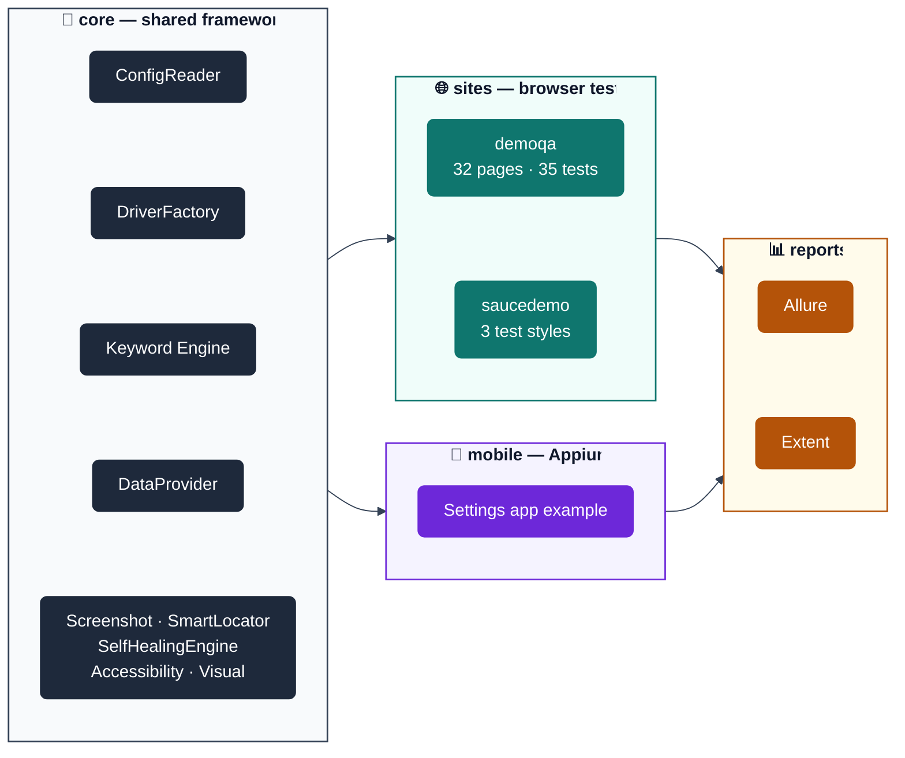

<<<<<<< HEAD
# 🤖 Selenium Automation Framework — Advanced Edition

> **A production-grade, multi-site Java test automation framework** built on Selenium 4 + TestNG + Maven, with dual reporting (Allure + Extent), data-driven testing across 5 file formats, keyword-driven scripting, accessibility (axe-core) and visual-regression (AShot) checks, an opt-in JMeter performance smoke check, a mobile/Appium module, human-like interaction simulation, a Dockerized Selenium Grid, and a triple CI/CD pipeline (Jenkins + GitHub Actions + GitLab CI).

<!--
  CI Status badge below is a static placeholder — the dynamic GitHub Actions
  badge (…/actions/workflows/github-ci.yml/badge.svg) only resolves once
  this repo is pushed to GitHub as a public (or at least badge-visible)
  repo. Swap the line below for:
    /<your-repo>/actions/workflows/github-ci.yml/badge.svg">
  once that's true — until then the dynamic badge just renders as a broken
  image, which is why it's a static one here instead.
-->
<p align="left">
  
  
  
  
  
  
  
  
  
  
  
  
  
</p>

### ⚡ At a Glance

| | |
|---|---|
| 🧱 **Language / Build** | Java 17 · Maven |
| 🧪 **Test Runner** | TestNG 7.9.0 (parallel-ready, retry-aware) |
| 🌐 **Browser Engine** | Selenium 4.21.0 (Chrome, Firefox, Edge, Brave) |
| 📄 **Design Pattern** | Page Object Model |
| 🧩 **Sites Covered** | demoqa.com (Elements, Forms, Widgets, Interactions, Book Store — UI + REST) · saucedemo.com (data-driven + keyword-driven reference site) — both also show the keyword-driven style (`KeywordDrivenTextBoxTest`, `KeywordDrivenLoginTest`) |
| 📊 **Data-Driven Formats** | Excel · CSV · JSON · YAML · ZIP — same `DataRow` shape from every format |
| 🧵 **Keyword-Driven Testing** | CSV-scripted test cases (`NAVIGATE`, `TYPE`, `CLICK`, `VERIFY_*`, ...) resolved against a locator `ObjectRepository` — new scenarios need no Java. See [`KEYWORD_DRIVEN_TESTING.md`](KEYWORD_DRIVEN_TESTING.md) |
| 🌐 **API Testing** | Rest-Assured — pure-HTTP Book Store flow (`BookStoreApiTest`), independent of the browser tests |
| ♿ **Accessibility** | axe-core (WCAG/GIGW-adjacent) scanning — opt-in `accessibility` group, `testng-suites/demoqa-accessibility.xml` |
| 🖼️ **Visual Regression** | AShot pixel-diff screenshots — opt-in `visual` group, `testng-suites/demoqa-visual.xml` |
| ⏱️ **Performance Smoke** | JMeter response-time/response-code check — opt-in `mvn verify -Pperf` |
| 📱 **Mobile (Appium)** | `AndroidDriver`/`IOSDriver` via `com.automation.mobile` — working example against Android's built-in Settings app, `-Dsite=mobile`. See [`mobile/README.md`](src/main/java/com/automation/mobile/README.md) |
| 📈 **Reporting** | Allure (interactive) + Extent (self-contained HTML) |
| 📊 **Code Coverage** | JaCoCo — HTML report at `target/site/jacoco/index.html` on every `mvn test` |
| 🧹 **Code Quality Gate** | Checkstyle (`checkstyle.xml`) — opt-in via `mvn verify` |
| 🔁 **Resilience** | Auto-retry on failure (`RetryAnalyzer`), human-like pacing, auto screenshot, page-source dump on locator failure, self-healing locators (`SelfHealingEngine` — automatic DOM-similarity recovery on every page object, `SmartLocator` for explicit hand-picked fallbacks) |
| 🐳 **Local Grid** | `docker-compose.yml` — Selenium Hub + Chrome/Firefox/Edge nodes with live noVNC viewing |
| 🔄 **CI/CD** | Jenkinsfile · `.github/workflows/github-ci.yml` · `.gitlab-ci.yml` (all three included and runnable as-is, including a dedicated mobile/Appium job in each) |

---

## 🚀 Quick Start

```bash
# 1. Clone and enter the project
git clone <repo-url> && cd selenium-automation-framework

# 2. Run the demoqa smoke suite (fastest sanity check — Chrome, visible browser)
mvn test -Dsite=demoqa -DsuiteXmlFile=testng-suites/demoqa-smoke.xml

# 3. Open the report
open target/extent-reports/demoqa-report.html   # macOS
# or: xdg-open target/extent-reports/demoqa-report.html   # Linux
```

Prefer not to install Chrome/Firefox/Edge locally? Skip straight to [🐳 Running Against a Dockerized Selenium Grid](docs/configuration.md#-running-against-a-dockerized-selenium-grid).

---

## 📋 Table of Contents

- [Quick Start](#-quick-start)
- [Tech Stack](#%EF%B8%8F-tech-stack)
- [Project Structure](#%EF%B8%8F-project-structure)
- [Running Tests Locally](#-running-tests-locally)
- [Conventions Cheatsheet](CONVENTIONS.md) — quick "how do I do X here" reference: writing a Page Object/Test, logging, config, reports, CI
- **Deep dives (in `/docs`):**
  - [Architecture & Design](docs/architecture.md) — how a test runs, core files, page-object pattern, key Selenium concepts
  - [Testing Guide](docs/testing-guide.md) — retry/resilience, coverage, REST API tests, keyword/data-driven testing, accessibility/visual/perf testing, mobile, smoke vs regression
  - [Configuration & Environments](docs/configuration.md) — `global.properties`, Dockerized Selenium Grid
  - [Reports & Code Quality](docs/reports-and-quality.md) — test reports, JaCoCo coverage, Checkstyle
  - [CI/CD Pipelines](docs/ci-cd.md) — Jenkins, GitHub Actions, GitLab CI
  - [Extending the Framework](docs/extending.md) — adding a new site, debugging a live site redesign
  - [Troubleshooting & Glossary](docs/troubleshooting.md) — common errors and fixes, glossary
  - [Roadmap](docs/roadmap.md) — suggestions and planned work
- [Contributing](#-contributing)
- [License](#-license)

## ⚙️ Tech Stack

| Tool | Version | Purpose |
|---|---|---|
| Java | 17 | Programming language |
| Selenium | 4.21.0 | Browser automation |
| TestNG | 7.9.0 | Test runner, retry, grouping (`smoke`/`regression`/`accessibility`/`visual`) |
| Maven | 3.9+ | Build and dependency management |
| Allure | 2.27.0 | Interactive test report with history/trends |
| ExtentReports | 5.1.2 | Self-contained HTML test report |
| Rest-Assured | 5.4.0 | Pure-HTTP API testing (Book Store REST flow) |
| Apache POI | 5.2.5 | Reads/writes the `.xlsx` data-driven format |
| OpenCSV | 5.9 | Reads the `.csv` data-driven format |
| Jackson | 2.17.1 | Reads the `.json` data-driven format |
| SnakeYAML | 2.2 | Reads the `.yaml` data-driven format |
| axe-core (Deque) | 4.9.1 | Accessibility (WCAG/GIGW-adjacent) scanning — `AccessibilityUtils` |
| AShot | 1.5.4 | Pixel-level visual regression screenshots/diffing — `VisualRegressionUtils` |
| Appium Java Client | 9.3.0 | Mobile automation (Android/iOS) — `com.automation.mobile` |
| JMeter (via `jmeter-maven-plugin`) | 3.8.0 | Opt-in performance smoke check (`mvn verify -Pperf`) |
| Lombok | 1.18.46 | Boilerplate reduction (`@Getter` etc.) on select POJOs |
| JaCoCo | 0.8.12 | Code coverage instrumentation + HTML report |
| Checkstyle | 3.5.0 (plugin) | Static analysis quality gate, opt-in via `mvn verify` |
| WebDriverManager | 6.1.0 | Automatic browser driver download/version match |
| Docker / Selenium Grid | 4.21.0 images | Optional containerized Chrome/Firefox/Edge nodes |
| Jenkins | Latest | CI/CD pipeline (local or server) |
| GitHub Actions | — | CI/CD pipeline + Allure history on GitHub Pages |
| GitLab CI | Latest | CI/CD pipeline |

---

## 🗂️ Project Structure

```
selenium-automation-framework/
│
├── Jenkinsfile                          # Jenkins CI/CD pipeline
├── .gitlab-ci.yml                       # GitLab CI/CD pipeline
├── .github/workflows/github-ci.yml      # GitHub Actions pipeline (build → test → Allure→Pages)
├── docker-compose.yml                   # Selenium Grid (hub + chrome/firefox/edge nodes) + test runner
├── Dockerfile                           # Image the `tests` service in docker-compose builds
├── pom.xml                              # Maven dependencies and build config (incl. opt-in `perf` profile)
├── checkstyle.xml                       # Code-quality ruleset, enforced by `mvn verify`
├── KEYWORD_DRIVEN_TESTING.md            # Deep-dive on the keyword-driven engine (see below)
├── DOCKER.md                            # Selenium Grid setup in detail
├── README.md                            # This file
│
├── Scripts/
│   └── new-site.sh                      # Scaffolds config + suites + all 3 testing styles (standard/keyword/file-driven) for a new site in one command
│
├── perf/
│   └── basic-smoke.jmx                  # JMeter plan for the opt-in `mvn verify -Pperf` response-time smoke check
│
├── testng-suites/                       # TestNG suite files
│   ├── demoqa-smoke.xml                 # demoqa — quick sanity checks (smoke group)
│   ├── demoqa-regression.xml            # demoqa — full test suite (regression group)
│   ├── demoqa-accessibility.xml         # demoqa — opt-in axe-core scan (accessibility group)
│   ├── demoqa-visual.xml                # demoqa — opt-in AShot visual regression (visual group)
│   ├── saucedemo-smoke.xml              # saucedemo — quick sanity checks
│   ├── saucedemo-regression.xml         # saucedemo — full test suite
│   ├── mobile-smoke.xml                 # mobile — opt-in Appium smoke check (smoke group)
│   └── mobile-regression.xml            # mobile — opt-in Appium regression (regression group)
│
└── src/
    │
    ├── main/java/com/automation/        # PRODUCTION code — Page Objects + shared framework
    │   │
    │   ├── core/                        # SHARED framework — never site-specific
    │   │   ├── base/
    │   │   │   ├── BasePage.java        # Parent of every Page Object — shared driver/wait helpers
    │   │   │   └── DriverProvider.java  # Thread-safe accessor Page Objects use to reach the active WebDriver
    │   │   ├── config/
    │   │   │   └── ConfigReader.java    # Reads layered config files
    │   │   ├── driver/
    │   │   │   └── DriverFactory.java   # Creates Chrome/Firefox/Edge driver
    │   │   ├── data/                    # Data-driven testing (Excel/CSV/JSON/YAML/ZIP)
    │   │   │   ├── DataProvider.java        # TestNG @DataProvider — reads any supported format
    │   │   │   ├── DataProviderFactory.java # Picks the right file-format reader
    │   │   │   └── DataRow.java             # One row of test data as a typed object
    │   │   ├── keyword/                 # Keyword-driven engine — see KEYWORD_DRIVEN_TESTING.md
    │   │   │   ├── Keyword.java             # Enum of supported actions (CLICK, TYPE, VERIFY_*, ...)
    │   │   │   ├── KeywordStep.java         # One script row: testCase, step, keyword, locator, data
    │   │   │   ├── ObjectRepository.java    # Loads `type:value` locators from a .properties file
    │   │   │   ├── KeywordReader.java       # Reads a script file into ordered steps per test case
    │   │   │   └── KeywordEngine.java       # Executes a List<KeywordStep> against a live WebDriver
    │   │   ├── report/
    │   │   │   ├── ExtentManager.java           # Creates HTML report (singleton)
    │   │   │   └── AllureEnvironmentWriter.java # Writes environment.properties + categories.json
    │   │   ├── utils/
    │   │   │   ├── HumanActions.java            # Human-like delays on every action
    │   │   │   ├── ScreenshotUtil.java           # Captures screenshots on pass/failure
    │   │   │   ├── FailureDiagnostics.java       # Page-source + browser console dump on failure
    │   │   │   ├── SmartLocator.java             # Tries a primary locator, falls back to alternates
    │   │   │   ├── AccessibilityUtils.java       # axe-core wrapper — WCAG/GIGW-adjacent scanning
    │   │   │   └── VisualRegressionUtils.java    # AShot wrapper — baseline capture + pixel-diff
    │   │   └── selfhealing/                      # Automatic self-healing locators (see docs/architecture.md)
    │   │       ├── SelfHealingEngine.java        # Auto re-finds a broken locator by DOM similarity
    │   │       ├── LocatorRepository.java        # Persists known-good element fingerprints across runs
    │   │       └── ElementFingerprint.java / HealingEvent.java / SelfHealingReportWriter.java
    │   │
    │   ├── sites/                       # SITE-SPECIFIC Page Objects only
    │   │   ├── demoqa/pages/            # 32 Page Objects — Elements, Forms, Widgets, Interactions, Book Store
    │   │   └── saucedemo/pages/
    │   │       └── LoginPage.java       # Login page — used by 3 different test styles (see below)
    │   │
    │   └── mobile/                      # Mobile (Appium) module — see mobile/README.md
    │       ├── README.md                # Module-specific setup guide
    │       ├── core/
    │       │   ├── AppiumDriverFactory.java  # Creates AndroidDriver/IOSDriver from config
    │       │   └── BaseMobilePage.java       # Mobile counterpart to BasePage — shared wait helpers
    │       └── sites/settings/pages/
    │           └── SettingsHomePage.java     # Example screen object (Android's built-in Settings app)
    │
    └── test/
        ├── java/com/automation/
        │   ├── sites/
        │   │   ├── core/
        │   │   │   ├── BaseTest.java            # Opens/closes browser per test
        │   │   │   └── KeywordTestBase.java     # extends BaseTest — adds runKeywordTestCase(...)
        │   │   ├── listeners/                   # SHARED TestNG listeners
        │   │   │   ├── TestListener.java        # Connects results to Extent + Allure
        │   │   │   ├── RetryAnalyzer.java        # Retries a failed test up to retry.count times
        │   │   │   └── RetryListener.java        # Auto-attaches RetryAnalyzer to every @Test
        │   │   ├── demoqa/tests/                 # 34 test classes, including:
        │   │   │   │                             #   BookStoreApiTest        — REST, no browser
        │   │   │   │                             #   BookStoreApplicationTest — full UI E2E
        │   │   │   │                             #   KeywordDrivenTextBoxTest — keyword-driven port
        │   │   │   │                             #   AccessibilityTest       — axe-core scan
        │   │   │   │                             #   VisualRegressionTest    — AShot pixel-diff
        │   │   └── saucedemo/tests/
        │   │       ├── LoginTest.java            # Classic hardcoded-values UI test
        │   │       ├── LoginDataDrivenTest.java  # Same flow, values sourced from DataProvider
        │   │       └── KeywordDrivenLoginTest.java # Same flow again, scripted as keyword rows (no Java per case)
        │   │
        │   └── mobile/                          # Mobile test classes — mirrors sites/ above
        │       ├── core/
        │       │   └── MobileBaseTest.java      # Opens/closes the Appium driver per test
        │       └── sites/settings/tests/
        │           └── SettingsHomeTest.java    # Example test against the Settings screen object
        │
        └── resources/
            ├── logging.properties            # Silences noisy Selenium/CDP warnings
            ├── allure.properties
            ├── config/
            │   ├── global.properties             # Shared defaults for all sites
            │   ├── demoqa.properties             # demoqa-specific overrides (URL, timeout)
            │   ├── saucedemo.properties          # saucedemo-specific overrides
            │   ├── mobile.properties.example     # Copy to mobile.properties, run with -Dsite=mobile
            │   └── _TEMPLATE.properties.example  # Copy this when adding a new site
            ├── objectrepository/
            │   ├── demoqa.properties          # Keyword-engine locators for the Text Box flow
            │   └── saucedemo.properties       # Keyword-engine locators: `saucedemo.login.username=id:user-name`
            └── testdata/
                ├── login.csv / .json / .xlsx / .yaml / .zip   # Same data, 5 formats — DataProvider reads any
                └── keyword/
                    ├── saucedemo_login_keywords.csv     # Scripted login test cases for the keyword engine
                    └── demoqa_textbox_keywords.csv       # Scripted Text Box test cases for the keyword engine
```

> **Three modules live here, not one.** `demoqa` is the deep Page-Object-Model suite (Elements/Forms/Widgets/Interactions/Book Store, UI + REST), and also carries the accessibility/visual-regression opt-in suites. `saucedemo` is smaller by page count but demonstrates the same login flow three different ways — plain, data-driven, and keyword-driven — as a working reference for whichever style a new test suite needs. `mobile` is a separate Appium module for Android/iOS app testing, run with `-Dsite=mobile` rather than a browser. See [Keyword-Driven & Data-Driven Testing](docs/testing-guide.md#-keyword-driven--data-driven-testing) and [Mobile Testing (Appium)](docs/testing-guide.md#-mobile-testing-appium) in the Testing Guide.

### 🧬 Module Map — how the pieces connect



Every site/mobile module leans on the same `core` — no test class ever re-implements config loading, driver creation, retries, or reporting; it just extends `BaseTest`/`MobileBaseTest` and gets all of it for free. That's what makes [➕ Adding a New Site](docs/extending.md#-adding-a-new-site--auto-configured-across-all-3-testing-styles) a one-command operation instead of a copy-paste job.

---

## 🚀 Running Tests Locally

### Prerequisites
- Java 17 — `java -version`
- Maven 3.9+ — `mvn -version`
- Chrome/Firefox/Edge browser installed (or use the [Docker Grid](docs/configuration.md#-running-against-a-dockerized-selenium-grid) instead)

### Commands

```bash
# Smoke suite — quick sanity check
mvn test -Dsite=demoqa -DsuiteXmlFile=testng-suites/demoqa-smoke.xml

# Full regression suite
mvn test -Dsite=demoqa -DsuiteXmlFile=testng-suites/demoqa-regression.xml

# Single test class only
mvn test -Dsite=demoqa -DsuiteXmlFile=testng-suites/demoqa-regression.xml -Dtest=ButtonsTest

# Different browser
mvn test -Dsite=demoqa -DsuiteXmlFile=testng-suites/demoqa-regression.xml -Dbrowser=firefox

# Headless — no browser window
mvn test -Dsite=demoqa -DsuiteXmlFile=testng-suites/demoqa-regression.xml -Dheadless=true

# Slow mode — watch every action clearly
mvn test -Dhuman.pause.min=2000 -Dhuman.pause.max=3000 -Dtest=ButtonsTest

# Fast mode — disable all pauses
mvn test -Dhuman.pause.enabled=false -DsuiteXmlFile=testng-suites/demoqa-smoke.xml
```

---

## 🤝 Contributing

This started as a personal/portfolio framework, but it's structured to take contributions cleanly:

1. **Before opening a PR**, run both gates locally — `mvn test` (must pass) and `mvn verify` (Checkstyle; see [🧹 Code Quality — Checkstyle](docs/reports-and-quality.md#-code-quality--checkstyle)). CI currently only runs the former, so `verify` catching something CI won't is expected, not a false positive.
2. **New site?** Use `Scripts/new-site.sh` rather than hand-rolling config — see [➕ Adding a New Site](docs/extending.md#-adding-a-new-site--auto-configured-across-all-3-testing-styles).
3. **New Page Object method?** Route clicks/types through `HumanActions`, not raw `WebElement` calls — that's what keeps every action showing up as an Allure step for free.
4. **Bug fixes**, especially ones like the DemoQA `200`-vs-`204` mismatch in [Common Errors and Fixes](docs/troubleshooting.md#-common-errors-and-fixes), are exactly the kind of PR this project wants — a one-line fix plus a one-line addition to that table so the next person doesn't re-discover it the hard way.

Keep PRs scoped to one concern (one bug, one site, one feature) — this project's commit history is meant to be a readable log of *why* things are the way they are, not just *what* changed, so a PR description that explains the "why" is worth as much as the diff itself.

---

## 📜 License

MIT — see [`LICENSE`](LICENSE). Use freely for learning, portfolio, and real-world QA practice.
=======
# selenium-automation-framework-Advanced


## Getting started

To make it easy for you to get started with GitLab, here's a list of recommended next steps.

Already a pro? Just edit this README.md and make it your own. Want to make it easy? [Use the template at the bottom](#editing-this-readme)!

## Add your files

- [ ] [Create](https://docs.gitlab.com/ee/user/project/repository/web_editor.html#create-a-file) or [upload](https://docs.gitlab.com/ee/user/project/repository/web_editor.html#upload-a-file) files
- [ ] [Add files using the command line](https://docs.gitlab.com/ee/gitlab-basics/add-file.html#add-a-file-using-the-command-line) or push an existing Git repository with the following command:

```
cd existing_repo
git remote add origin https://192.168.1.130/amitthakor304/selenium-automation-framework-advanced.git
git branch -M main
git push -uf origin main
```

## Integrate with your tools

- [ ] [Set up project integrations](https://192.168.1.130/amitthakor304/selenium-automation-framework-advanced/-/settings/integrations)

## Collaborate with your team

- [ ] [Invite team members and collaborators](https://docs.gitlab.com/ee/user/project/members/)
- [ ] [Create a new merge request](https://docs.gitlab.com/ee/user/project/merge_requests/creating_merge_requests.html)
- [ ] [Automatically close issues from merge requests](https://docs.gitlab.com/ee/user/project/issues/managing_issues.html#closing-issues-automatically)
- [ ] [Enable merge request approvals](https://docs.gitlab.com/ee/user/project/merge_requests/approvals/)
- [ ] [Set auto-merge](https://docs.gitlab.com/ee/user/project/merge_requests/merge_when_pipeline_succeeds.html)

## Test and Deploy

Use the built-in continuous integration in GitLab.

- [ ] [Get started with GitLab CI/CD](https://docs.gitlab.com/ee/ci/quick_start/index.html)
- [ ] [Analyze your code for known vulnerabilities with Static Application Security Testing (SAST)](https://docs.gitlab.com/ee/user/application_security/sast/)
- [ ] [Deploy to Kubernetes, Amazon EC2, or Amazon ECS using Auto Deploy](https://docs.gitlab.com/ee/topics/autodevops/requirements.html)
- [ ] [Use pull-based deployments for improved Kubernetes management](https://docs.gitlab.com/ee/user/clusters/agent/)
- [ ] [Set up protected environments](https://docs.gitlab.com/ee/ci/environments/protected_environments.html)

***

# Editing this README

When you're ready to make this README your own, just edit this file and use the handy template below (or feel free to structure it however you want - this is just a starting point!). Thanks to [makeareadme.com](https://www.makeareadme.com/) for this template.

## Suggestions for a good README

Every project is different, so consider which of these sections apply to yours. The sections used in the template are suggestions for most open source projects. Also keep in mind that while a README can be too long and detailed, too long is better than too short. If you think your README is too long, consider utilizing another form of documentation rather than cutting out information.

## Name
Choose a self-explaining name for your project.

## Description
Let people know what your project can do specifically. Provide context and add a link to any reference visitors might be unfamiliar with. A list of Features or a Background subsection can also be added here. If there are alternatives to your project, this is a good place to list differentiating factors.

## Badges
On some READMEs, you may see small images that convey metadata, such as whether or not all the tests are passing for the project. You can use Shields to add some to your README. Many services also have instructions for adding a badge.

## Visuals
Depending on what you are making, it can be a good idea to include screenshots or even a video (you'll frequently see GIFs rather than actual videos). Tools like ttygif can help, but check out Asciinema for a more sophisticated method.

## Installation
Within a particular ecosystem, there may be a common way of installing things, such as using Yarn, NuGet, or Homebrew. However, consider the possibility that whoever is reading your README is a novice and would like more guidance. Listing specific steps helps remove ambiguity and gets people to using your project as quickly as possible. If it only runs in a specific context like a particular programming language version or operating system or has dependencies that have to be installed manually, also add a Requirements subsection.

## Usage
Use examples liberally, and show the expected output if you can. It's helpful to have inline the smallest example of usage that you can demonstrate, while providing links to more sophisticated examples if they are too long to reasonably include in the README.

## Support
Tell people where they can go to for help. It can be any combination of an issue tracker, a chat room, an email address, etc.

## Roadmap
If you have ideas for releases in the future, it is a good idea to list them in the README.

## Contributing
State if you are open to contributions and what your requirements are for accepting them.

For people who want to make changes to your project, it's helpful to have some documentation on how to get started. Perhaps there is a script that they should run or some environment variables that they need to set. Make these steps explicit. These instructions could also be useful to your future self.

You can also document commands to lint the code or run tests. These steps help to ensure high code quality and reduce the likelihood that the changes inadvertently break something. Having instructions for running tests is especially helpful if it requires external setup, such as starting a Selenium server for testing in a browser.

## Authors and acknowledgment
Show your appreciation to those who have contributed to the project.

## License
For open source projects, say how it is licensed.

## Project status
If you have run out of energy or time for your project, put a note at the top of the README saying that development has slowed down or stopped completely. Someone may choose to fork your project or volunteer to step in as a maintainer or owner, allowing your project to keep going. You can also make an explicit request for maintainers.
>>>>>>> 4a1821080b666f87d8fe2685d7aab119b9a917c8
