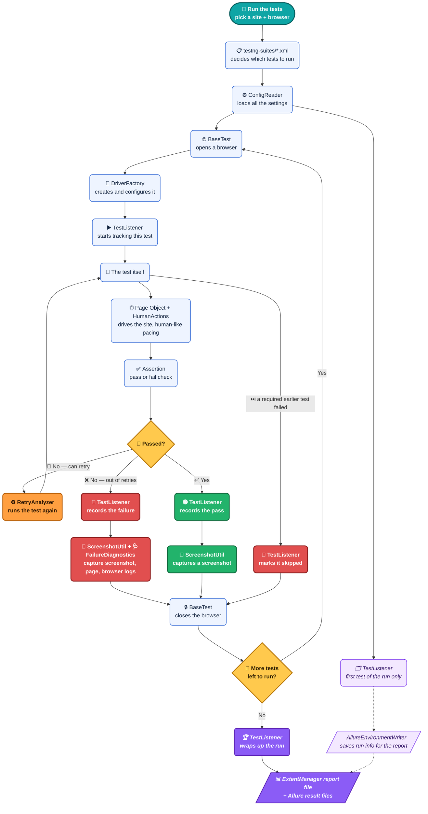
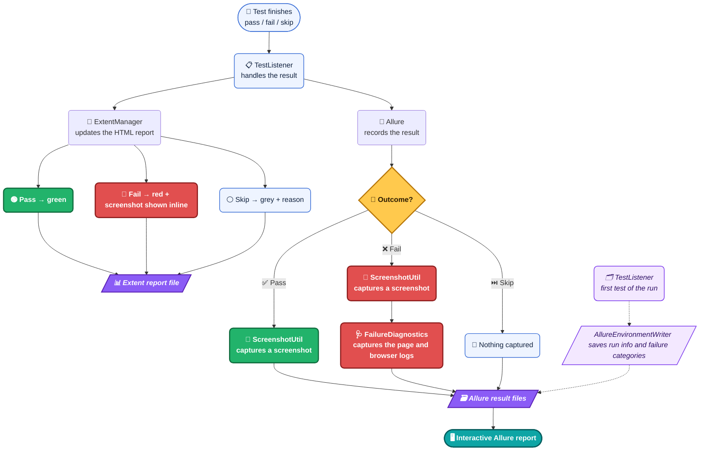

# 🤖 Selenium Automation Framework — Advanced Edition

> **A production-grade, multi-site Java test automation framework** built on Selenium 4 + TestNG + Maven, with dual reporting (Allure + Extent), data-driven testing across 4 file formats, human-like interaction simulation, a Dockerized Selenium Grid, and a triple CI/CD pipeline (Jenkins + GitHub Actions + GitLab CI).

<p align="left">
  
  
  
  
  
  
  
  
  
  
  
  
  
</p>

### ⚡ At a Glance

| | |
|---|---|
| 🧱 **Language / Build** | Java 17 · Maven |
| 🧪 **Test Runner** | TestNG 7.9.0 (parallel-ready, retry-aware) |
| 🌐 **Browser Engine** | Selenium 4.21.0 (Chrome, Firefox, Edge, Brave) |
| 📄 **Design Pattern** | Page Object Model |
| 🧩 **Sites Covered** | demoqa.com (Elements, Forms, Widgets, Interactions, Book Store — UI + REST) · saucedemo.com (data-driven + keyword-driven reference site) |
| 📊 **Data-Driven Formats** | Excel · CSV · JSON · ZIP |
| 🌐 **API Testing** | Rest-Assured — pure-HTTP Book Store flow (`BookStoreApiTest`), independent of the browser tests |
| 📈 **Reporting** | Allure (interactive) + Extent (self-contained HTML) |
| 📊 **Code Coverage** | JaCoCo — HTML report at `target/site/jacoco/index.html` on every `mvn test` |
| 🧹 **Code Quality Gate** | Checkstyle (`checkstyle.xml`) — opt-in via `mvn verify` |
| 🔁 **Resilience** | Auto-retry on failure (`RetryAnalyzer`), human-like pacing, auto screenshot, page-source dump on locator failure |
| 🐳 **Local Grid** | `docker-compose.yml` — Selenium Hub + Chrome/Firefox/Edge nodes with live noVNC viewing |
| 🔄 **CI/CD** | Jenkinsfile · `.github/workflows/github-ci.yml` · `.gitlab-ci.yml` (all three included and runnable as-is) |

---

## 🚀 Quick Start

```bash
# 1. Clone and enter the project
git clone <repo-url> && cd selenium-automation-framework

# 2. Run the demoqa smoke suite (fastest sanity check — Chrome, visible browser)
mvn test -Dsite=demoqa -DsuiteXmlFile=testng-suites/demoqa-smoke.xml

# 3. Open the report
open target/extent-reports/demoqa-report.html   # macOS
# or: xdg-open target/extent-reports/demoqa-report.html   # Linux
```

Prefer not to install Chrome/Firefox/Edge locally? Skip straight to [🐳 Running Against a Dockerized Selenium Grid](#-running-against-a-dockerized-selenium-grid).

---

## 📋 Table of Contents

- [🧠 What Is This? (From Scratch)](#-what-is-this-from-scratch)
- [🏗️ Architecture — How a Test Runs](#️-architecture--how-a-test-runs)
- [⚙️ Tech Stack](#️-tech-stack)
- [🗂️ Project Structure](#️-project-structure)
- [🔑 Core Files — What Each One Does](#-core-files--what-each-one-does)
- [🔁 Retry & Resilience](#-retry--resilience)
- [📄 Page Objects — Pattern Explained](#-page-objects--pattern-explained)
- [🧩 Test Coverage — demoqa.com](#-test-coverage--demoqacom)
- [🌐 Book Store REST API Tests](#-book-store-rest-api-tests)
- [🧵 Keyword-Driven & Data-Driven Testing (saucedemo)](#-keyword-driven--data-driven-testing-saucedemo)
- [🚀 Running Tests Locally](#-running-tests-locally)
- [🐳 Running Against a Dockerized Selenium Grid](#-running-against-a-dockerized-selenium-grid)
- [🔧 Configuration — `global.properties`](#-configuration--globalproperties)
- [📈 Test Reports](#-test-reports)
- [📊 Code Coverage — JaCoCo](#-code-coverage--jacoco)
- [🧹 Code Quality — Checkstyle](#-code-quality--checkstyle)
- [🚦 Smoke vs Regression](#-smoke-vs-regression)
- [🔄 Jenkins CI/CD Setup](#-jenkins-cicd-setup)
- [🐙 GitHub Actions Pipeline](#-github-actions-pipeline)
- [🦊 GitLab CI/CD Pipeline](#-gitlab-cicd-pipeline)
- [➕ Adding a New Site — 4 Steps](#-adding-a-new-site--4-steps)
- [🧭 Debugging a Live Site Redesign — Lessons from a Real Session](#-debugging-a-live-site-redesign--lessons-from-a-real-session)
- [🧰 Key Selenium Concepts Used](#-key-selenium-concepts-used)
- [🩹 Common Errors and Fixes](#-common-errors-and-fixes)
- [🗺️ Suggestions & Roadmap](#️-suggestions--roadmap)
- [📖 Glossary](#-glossary)
- [🤝 Contributing](#-contributing)
- [📜 License](#-license)

---

## 🧠 What Is This? (From Scratch)

### 🔰 What is Selenium?
Selenium is a **browser automation library**. It lets your Java code control a real browser — open URLs, click buttons, fill forms, read text — exactly like a human would.

```
Your Java Code  →  Selenium WebDriver  →  ChromeDriver  →  Chrome Browser  →  Website
```

### 🔰 What is TestNG?
TestNG is a **test runner** for Java. It finds your `@Test` methods, runs them in order, tracks pass/fail, and generates reports.

### 🔰 What is Maven?
Maven is a **build tool**. It downloads your dependencies (Selenium, TestNG…) from the internet, compiles your code, and runs your tests — all with one command.

### 🔰 What is the Page Object Model (POM)?
POM is a **design pattern**: every web page gets its own Java class. The class knows how to interact with that page. Tests call the page class — they never interact with the browser directly. This keeps code clean and reusable.

A production-ready, scalable Java + Selenium automation framework built for learning and real-world QA practice. Covers the demoqa.com test suite with Jenkins, GitHub Actions, and GitLab CI/CD integration, dual Allure + Extent reporting, and human-like interaction simulation.

---

## 🏗️ Architecture — How a Test Runs



**Reading it, in plain terms:**
1. **Setup (once per run)** — `testng-suites/*.xml` decides which tests run, `ConfigReader` loads the settings, and `TestListener` (on the very first test only) has `AllureEnvironmentWriter` save the run's details for later.
2. **Setup (per test)** — `BaseTest` asks `DriverFactory` to open a browser, then `TestListener` starts tracking the test.
3. **Act** — the test drives the site through its Page Object, with `HumanActions` adding realistic pacing between actions.
4. **Check** — an assertion decides pass or fail. A failure with retries left goes back through `RetryAnalyzer` and runs again; if a required earlier test failed, this one is skipped instead of run at all.
5. **Record** — `TestListener` hands off to `ScreenshotUtil` (always) and `FailureDiagnostics` (failures only, for the page and browser logs).
6. **Teardown** — `BaseTest` closes the browser, then the next test (if any) starts the per-test cycle again from step 2.
7. **Finish** — once the suite is done, `TestListener` wraps everything up and the final report files are written.

For the full breakdown of what happens after step 5 — which files get written and what each report shows — see [📈 Test Reports](#-test-reports).

---

## ⚙️ Tech Stack

| Tool | Version | Purpose |
|---|---|---|
| Java | 17 | Programming language |
| Selenium | 4.21.0 | Browser automation |
| TestNG | 7.9.0 | Test runner, retry, grouping (`smoke`/`regression`) |
| Maven | 3.9+ | Build and dependency management |
| Allure | 2.27.0 | Interactive test report with history/trends |
| ExtentReports | 5.1.2 | Self-contained HTML test report |
| Rest-Assured | 5.4.0 | Pure-HTTP API testing (Book Store REST flow) |
| JaCoCo | 0.8.12 | Code coverage instrumentation + HTML report |
| Checkstyle | 3.5.0 (plugin) | Static analysis quality gate, opt-in via `mvn verify` |
| WebDriverManager | 6.1.0 | Automatic browser driver download/version match |
| Docker / Selenium Grid | 4.21.0 images | Optional containerized Chrome/Firefox/Edge nodes |
| Jenkins | Latest | CI/CD pipeline (local or server) |
| GitHub Actions | — | CI/CD pipeline + Allure history on GitHub Pages |
| GitLab CI | Latest | CI/CD pipeline |

---

## 🗂️ Project Structure

```
selenium-automation-framework/
│
├── Jenkinsfile                          # Jenkins CI/CD pipeline
├── .gitlab-ci.yml                       # GitLab CI/CD pipeline
├── .github/workflows/github-ci.yml      # GitHub Actions pipeline (build → test → Allure→Pages)
├── docker-compose.yml                   # Selenium Grid (hub + chrome/firefox/edge nodes) + test runner
├── Dockerfile                           # Image the `tests` service in docker-compose builds
├── pom.xml                              # Maven dependencies and build config
├── checkstyle.xml                       # Code-quality ruleset, enforced by `mvn verify`
├── KEYWORD_DRIVEN_TESTING.md            # Deep-dive on the keyword-driven engine (see below)
├── DOCKER.md                            # Selenium Grid setup in detail
├── README.md                            # This file
│
├── Scripts/
│   └── new-site.sh                      # Scaffolds config + suite XMLs for a new site in one command
│
├── testng-suites/                       # TestNG suite files
│   ├── demoqa-smoke.xml                 # demoqa — quick sanity checks (smoke group)
│   ├── demoqa-regression.xml            # demoqa — full test suite (regression group)
│   ├── saucedemo-smoke.xml              # saucedemo — quick sanity checks
│   └── saucedemo-regression.xml         # saucedemo — full test suite
│
└── src/
    │
    ├── main/java/com/automation/        # PRODUCTION code — Page Objects + shared framework
    │   │
    │   ├── core/                        # SHARED framework — never site-specific
    │   │   ├── base/
    │   │   │   ├── BasePage.java        # Parent of every Page Object — shared driver/wait helpers
    │   │   │   └── DriverProvider.java  # Thread-safe accessor Page Objects use to reach the active WebDriver
    │   │   ├── config/
    │   │   │   └── ConfigReader.java    # Reads layered config files
    │   │   ├── driver/
    │   │   │   └── DriverFactory.java   # Creates Chrome/Firefox/Edge driver
    │   │   ├── data/                    # Data-driven testing (Excel/CSV/JSON/YAML/ZIP)
    │   │   │   ├── DataProvider.java        # TestNG @DataProvider — reads any supported format
    │   │   │   ├── DataProviderFactory.java # Picks the right file-format reader
    │   │   │   └── DataRow.java             # One row of test data as a typed object
    │   │   ├── keyword/                 # Keyword-driven engine — see KEYWORD_DRIVEN_TESTING.md
    │   │   │   ├── Keyword.java             # Enum of supported actions (CLICK, TYPE, VERIFY_*, ...)
    │   │   │   ├── KeywordStep.java         # One script row: testCase, step, keyword, locator, data
    │   │   │   ├── ObjectRepository.java    # Loads `type:value` locators from a .properties file
    │   │   │   ├── KeywordReader.java       # Reads a script file into ordered steps per test case
    │   │   │   └── KeywordEngine.java       # Executes a List<KeywordStep> against a live WebDriver
    │   │   ├── report/
    │   │   │   ├── ExtentManager.java           # Creates HTML report (singleton)
    │   │   │   └── AllureEnvironmentWriter.java # Writes environment.properties + categories.json
    │   │   └── utils/
    │   │       ├── HumanActions.java        # Human-like delays on every action
    │   │       ├── ScreenshotUtil.java       # Captures screenshots on pass/failure
    │   │       └── FailureDiagnostics.java   # Page-source + browser console dump on failure
    │   │
    │   └── sites/                       # SITE-SPECIFIC Page Objects only
    │       ├── demoqa/pages/            # 35+ Page Objects — Elements, Forms, Widgets, Interactions, Book Store
    │       └── saucedemo/pages/
    │           └── LoginPage.java       # Login page — used by 3 different test styles (see below)
    │
    └── test/
        ├── java/com/automation/sites/
        │   ├── core/
        │   │   ├── BaseTest.java            # Opens/closes browser per test
        │   │   └── KeywordTestBase.java     # extends BaseTest — adds runKeywordTestCase(...)
        │   ├── listeners/                   # SHARED TestNG listeners
        │   │   ├── TestListener.java        # Connects results to Extent + Allure
        │   │   ├── RetryAnalyzer.java        # Retries a failed test up to retry.count times
        │   │   └── RetryListener.java        # Auto-attaches RetryAnalyzer to every @Test
        │   ├── demoqa/tests/                 # 35+ test classes, incl. BookStoreApiTest (REST) and
        │   │                                 # BookStoreApplicationTest (full UI E2E)
        │   └── saucedemo/tests/
        │       ├── LoginTest.java            # Classic hardcoded-values UI test
        │       ├── LoginDataDrivenTest.java  # Same flow, values sourced from DataProvider
        │       └── KeywordDrivenLoginTest.java # Same flow again, scripted as keyword rows (no Java per case)
        │
        └── resources/
            ├── logging.properties            # Silences noisy Selenium/CDP warnings
            ├── allure.properties
            ├── config/
            │   ├── global.properties             # Shared defaults for all sites
            │   ├── demoqa.properties             # demoqa-specific overrides (URL, timeout)
            │   ├── saucedemo.properties          # saucedemo-specific overrides
            │   └── _TEMPLATE.properties.example  # Copy this when adding a new site
            ├── objectrepository/
            │   └── saucedemo.properties      # Keyword-engine locators: `saucedemo.login.username=id:user-name`
            └── testdata/
                ├── login.csv / .json / .xlsx / .yaml / .zip   # Same data, 5 formats — DataProvider reads any
                └── keyword/saucedemo_login_keywords.csv       # Scripted test cases for the keyword engine
```

> **Two sites live here, not one.** `demoqa` is the deep Page-Object-Model suite (Elements/Forms/Widgets/Interactions/Book Store, UI + REST). `saucedemo` is smaller by page count but demonstrates the same login flow three different ways — plain, data-driven, and keyword-driven — as a working reference for whichever style a new test suite needs. See [Keyword-Driven & Data-Driven Testing](#-keyword-driven--data-driven-testing-saucedemo) below.

---

## 🔑 Core Files — What Each One Does

### `BaseTest.java`
Parent class that every test extends. Handles browser lifecycle automatically.
```
@BeforeMethod → opens browser, navigates to site URL
@Test         → your test runs here
@AfterMethod  → closes browser, cleans ThreadLocal
```
Uses `ThreadLocal<WebDriver>` so each test thread gets its own browser instance — required for parallel execution. Test classes that manage a single shared session across many `@Test` methods (e.g. a full E2E flow that stays logged in) override `setUp()`/`tearDown()` to no-ops and drive the browser from `@BeforeClass`/`@AfterClass` instead — see `BookStoreApplicationTest` for the pattern.

### `BasePage.java`
Parent class every Page Object extends. Holds the shared `WebDriver`/`WebDriverWait` plumbing (via `DriverProvider`) and common helpers — explicit-wait wrappers, safe-click/safe-type variants — so individual page classes only need to declare locators and page-specific actions, not re-implement wait boilerplate 35 times over.

### `DriverProvider.java`
The bridge between `BaseTest` (which owns the `WebDriver` lifecycle) and Page Objects (which need to *use* that driver without owning it). Page Objects call into `DriverProvider` rather than taking a `WebDriver` constructor argument directly, keeping the thread-local browser instance a single source of truth.

### `ConfigReader.java`
Reads config in three layers, each overriding the previous:
```
global.properties   → base defaults
demoqa.properties   → site-specific overrides
-Dkey=value         → command line wins over everything
```
Call anywhere: `ConfigReader.get("browser")`, `ConfigReader.getInt("timeout", 10)`

### `DriverFactory.java`
Single place that creates the browser. Reads `browser` and `headless` from config. Supports Chrome, Firefox, Edge. Sets download folder to `target/downloads` so downloads work on both local machine and CI. When `GRID_ENABLED=true` is set (see [Docker section](#-running-against-a-dockerized-selenium-grid)), points at a remote `GRID_URL` instead of a local driver. For Chromium-based browsers (Chrome/Edge/Brave) it also turns on `goog:loggingPrefs` so the browser's JS console output can be captured — see `FailureDiagnostics.java` below.

### `HumanActions.java`
Wraps every Selenium click and type with random delays. Makes automation look human. All timings come from config so they can be tuned or disabled.
```java
HumanActions.click(driver, locator)        // pause → click
HumanActions.type(driver, locator, text)   // pause → type char by char
HumanActions.pause()                       // random pause min-max ms
HumanActions.postTestPause()               // longer pause after test ends
```
`click()`/`type()` are annotated `@Step`, so every Page Object call — across all 35+ page classes, with zero per-page edits — shows up as its own expandable, timestamped step in the Allure report. See [📈 Test Reports](#-test-reports).

### `DataProvider.java` / `DataProviderFactory.java` / `DataRow.java`
The data-driven trio behind `@Test(dataProvider = ...)` methods. `DataProviderFactory` picks the right reader for whichever file extension it's handed (`.csv`, `.json`, `.xlsx`, `.yaml`, or a `.zip` bundling several); `DataProvider` exposes the TestNG-facing `Object[][]`; `DataRow` is the typed wrapper each test method actually receives, so a test doesn't need to know or care which file format backed it. See `LoginDataDrivenTest` for the pattern in use, and [🧵 Keyword-Driven & Data-Driven Testing](#-keyword-driven--data-driven-testing-saucedemo) below.

### `Keyword.java` / `KeywordStep.java` / `ObjectRepository.java` / `KeywordReader.java` / `KeywordEngine.java` / `KeywordTestBase.java`
The keyword-driven engine — write new test *cases* as data-file rows instead of new Java methods. `Keyword` enumerates supported actions (`CLICK`, `TYPE`, `VERIFY_DISPLAYED`, `SWITCH_TO_FRAME`, ...); `ObjectRepository` loads locators from a `.properties` file (`type:value` pairs) kept separate from both the script and the test; `KeywordReader` groups a script file's rows into ordered `KeywordStep`s per test case; `KeywordEngine` executes that list against the live `WebDriver`; `KeywordTestBase` (extends `BaseTest`) gives test classes the one method they need — `runKeywordTestCase(objectRepo, scriptPath, testCase)`. Full walkthrough, including how to add a new scenario with zero new Java: **[`KEYWORD_DRIVEN_TESTING.md`](KEYWORD_DRIVEN_TESTING.md)**.

### `TestListener.java`
TestNG calls this at key moments. Drives **both** report engines from one place — Extent (always) and Allure (via the `allure-testng` SPI listener, which auto-registers itself; this class supplies the extra detail Allure doesn't capture on its own).
```
onStart       → writes environment.properties + categories.json (once per JVM)
onTestStart   → creates Extent entry; tags Allure severity + Site/Browser parameters
onTestSuccess → marks green; attaches pass screenshot to Allure
onTestFailure → marks red; attaches failure screenshot + page source + browser
                console logs + failed URL to Allure; embeds screenshot in Extent
onFinish      → flushes Extent HTML to disk; resets singletons for the next site
```
Registered via `@Listeners({TestListener.class, RetryListener.class})` on `BaseTest` — **not** in the suite XML's `<listeners>` block. That ordering matters: registering it through the suite XML instead puts it in a different position relative to Allure's own auto-registered listener, so by the time `onTestFailure` runs, Allure has already closed the test case and silently drops the attachment. Keep it on `BaseTest`.

### `FailureDiagnostics.java`
Best-effort failure forensics, called only from `TestListener.onTestFailure`, never from passing tests. Grabs the full page HTML (`capturePageSource`) and, for Chromium browsers only, the browser's JS console output since the last check (`captureBrowserConsoleLogs`). Both methods swallow their own exceptions — a browser that's already crashed, or a Firefox session with no console-log endpoint, must never turn a genuine test failure into a secondary `NullPointerException` inside the listener itself.

### `AllureEnvironmentWriter.java`
Writes two files Allure doesn't generate on its own straight into `target/allure-results`, once per JVM: `environment.properties` (feeds the report's **Environment** widget — site, browser, OS, Java version, retry count) and `categories.json` (feeds the **Categories** tab, auto-bucketing failures into Product Defects / Element-not-found / Timeouts / Driver issues / Skipped). `reset()` clears the "already written" flag so a second site's run in the same JVM (Jenkins looping over sites) regenerates its own environment file instead of keeping the first site's values.

### `ExtentManager.java`
Singleton that creates one shared HTML report per test run. Saves to `target/extent-reports/<site>-report.html`.

### `ScreenshotUtil.java`
Takes a PNG screenshot (as bytes, and as base64 for embedding) on test pass or failure. Called automatically by `TestListener` — never call manually.

---

## 🔁 Retry & Resilience

Two listeners work together so no test needs to opt in manually:

| File | Role |
|---|---|
| `RetryListener.java` | An `IAnnotationTransformer` — attaches `RetryAnalyzer` to **every** `@Test` at runtime, so individual test classes never need `retryAnalyzer = ...` boilerplate. |
| `RetryAnalyzer.java` | An `IRetryAnalyzer` — on failure, re-queues the test up to `retry.count` times (default **2**, from `global.properties`; override with `-Dretry.count=N`). |

```bash
# Disable retry entirely — useful when you want a failure to surface immediately
mvn test -Dretry.count=0 -Dtest=BookStoreApplicationTest
```

> ⚠️ **CI defaults to `retry.count=0`** in both the GitHub Actions workflow and typical Jenkins params, trading resilience for fast, unambiguous CI signal. Locally, leaving the default `2` in place absorbs one-off network/render hiccups without masking a real break.

Page objects add a second layer of resilience beyond retry: several locators are wrapped to dump the full page source to `target/debug-dumps/*.html` on a `TimeoutException`/`NoSuchElementException`, rather than failing with only a stack trace. See [🧭 Debugging a Live Site Redesign](#-debugging-a-live-site-redesign--lessons-from-a-real-session) for why that pattern exists and how to use the dumps it produces.

---

## 📄 Page Objects — Pattern Explained

Every webpage has its own Java class. Locators and actions live in the page class. Tests only call page methods — no locators ever appear in test files.

```java
// Page Object — knows HOW to interact with the page
public class TextBoxPage {
    private final By userName = By.id("userName");   // locator

    public void fillForm(String name) {               // action
        HumanActions.type(driver, userName, name);
    }

    public String getOutputName() {                   // getter
        return driver.findElement(outputName).getText();
    }
}

// Test — describes WHAT to verify
public class TextBoxTest extends BaseTest {
    @Test
    public void fillTextBoxForm() {
        TextBoxPage page = new TextBoxPage(getDriver());
        page.fillForm("Amit");                         // no locators here
        Assert.assertTrue(page.getOutputName().contains("Amit"));
    }
}
```

<details>
<summary><strong>Helpers in Page Objects</strong> — private methods that keep public methods clean</summary>

```java
// Helper — private, called only inside this class
private void scrollAndClick(By locator) {
    js.executeScript("arguments[0].scrollIntoView({block:'center'});", el);
    js.executeScript("arguments[0].click();", el);
}

// Public methods use helper — no duplication
public void selectSports()  { scrollAndClick(sportsLabel);  }
public void selectReading() { scrollAndClick(readingLabel); }
```
</details>

<details>
<summary><strong>Helpers in Test Classes</strong> — group related steps for shorter, readable tests</summary>

```java
private PracticeFormPage openForm() {
    PracticeFormPage page = new PracticeFormPage(getDriver());
    page.navigateToPracticeForm();
    return page;
}

private void fillPersonalDetails(PracticeFormPage page) {
    page.enterFirstName("Amit");
    page.enterLastName("Thakor");
    page.selectGender("male");
    page.enterMobile("9876543210");
}

@Test
public void verifyFormSubmission() {
    PracticeFormPage page = openForm();   // helper
    fillPersonalDetails(page);            // helper
    page.submitForm();
}
```
</details>

---

## 🧩 Test Coverage — demoqa.com

<details>
<summary><strong>Elements Section</strong></summary>

| Page | Description | Groups |
|---|---|---|
| Text Box | Fill and submit form, verify output | smoke, regression |
| Check Box | Expand tree, select Desktop checkbox | regression |
| Radio Button | Select Yes option, verify result | regression |
| Web Tables | Full CRUD — add, search, edit, delete | regression |
| Buttons | Double click, right click, dynamic click | regression |
| Links | Home link opens tab, API links return correct status codes | smoke, regression |
| Broken Links - Images | Valid image loads, broken image fails, link navigation | smoke, regression |
| Upload and Download | Upload file, download file to target folder | smoke, regression |
| Dynamic Properties | Enable after delay, color change, appear after delay | smoke, regression |
</details>

<details>
<summary><strong>Forms Section</strong></summary>

| Page | Description | Groups |
|---|---|---|
| Practice Form | Full form with all fields, mandatory fields only | smoke, regression |
</details>

<details>
<summary><strong>Alerts, Frame and Windows Section</strong></summary>

| Page | Description | Groups |
|---|---|---|
| Browser Windows | New tab, new window, message window | smoke, regression |
| Alerts | Simple alert, timer alert, confirm accept/dismiss, prompt | smoke, regression |
| Frames | Read text from frame 1 and frame 2 | smoke, regression |
| Nested Frames | Read parent frame text, child frame text | smoke, regression |
| Modal Dialogs | Small modal title/body, large modal title/body | smoke, regression |
</details>

<details>
<summary><strong>Widgets Section</strong></summary>

| Page | Description | Groups |
|---|---|---|
| Accordian | Section 1 default open, open section 2, open section 3 | smoke, regression |
| Auto Complete | Multi color select, single color select | smoke, regression |
| Date Picker | Select specific date from calendar | smoke, regression |
| Slider | Set value to 50, set value to 75 | smoke, regression |
| Progress Bar | Starts at 0, reaches 100, resets to 0 | smoke, regression |
| Tabs | What tab content, origin tab, use tab | smoke, regression |
| Tool Tips | Button tooltip on hover, text field tooltip on hover | smoke, regression |
| Menu | Main item visible, sub item on hover, nested sub sub item | smoke, regression |
| Select Menu | Old style select, standard multi select | smoke, regression |
</details>

<details open>
<summary><strong>Book Store Application — full E2E flow (16 tests, one shared session)</strong></summary>

`BookStoreApplicationTest` drives the entire Book Store Application as one continuous logged-in session rather than isolated page checks — registration through logout, with the profile/collection flow folded in as part of the same journey instead of a separate test class:

| # | Test | What it verifies |
|---|---|---|
| 1–3 | Register → back to login | New unique user registers successfully, lands back on `/login` |
| 4–5 | Invalid then valid login | Bad credentials rejected with an error message; correct credentials log in |
| 6–10 | Browse, search, open a book | Store lists books, search filters correctly, detail page shows ISBN/Author |
| 11–12 | Profile — identity & empty state | Profile shows the logged-in username; a new user's collection is empty |
| 13 | Add to collection | Adds a book from its detail page, accepts the resulting native alert |
| 14 | Book appears on profile | Polls until the added book is visible in the collection (see note below) |
| 15 | Delete from profile | Confirms the in-page delete modal, polls until the row is gone |
| 16 | Logout | Redirects to `/login`, closing out the session |

> Tests 11–16 replace what used to be a separate `ProfileTest` class — merged here so the whole flow (register → shop → manage collection → logout) runs against one real user session instead of two independently-registered ones.
</details>

---

## 🌐 Book Store REST API Tests

`BookStoreApiTest` covers the same Book Store domain as the UI flow above, but hits `demoqa.com`'s REST endpoints directly with Rest-Assured — no browser, no Selenium, independent of every other test class. It runs a single account through 9 sequential, dependency-chained tests (`dependsOnMethods`) using one shared `userId`/`authToken`/`sampleIsbn`:

| # | Test | Endpoint |
|---|---|---|
| 1 | Create account | `POST /Account/v1/User` |
| 2 | Generate token | `POST /Account/v1/GenerateToken` |
| 3 | Confirm authorized | `POST /Account/v1/Authorized` |
| 4 | Book catalogue non-empty (captures an ISBN) | `GET /BookStore/v1/Books` |
| 5 | Fetch that book by ISBN | `GET /BookStore/v1/Book?ISBN=...` |
| 6 | Add book to account | `POST /BookStore/v1/Books` |
| 7 | Book shows up on the user | `GET /Account/v1/User/{UUID}` |
| 8 | Remove book from account | `DELETE /BookStore/v1/Book` |
| 9 | Delete the account (cleanup, `alwaysRun`) | `DELETE /Account/v1/User/{UUID}` |

Two eventual-consistency details worth knowing if you're extending this class:

- **Test 8** polls up to 3 times (with a short sleep) after the delete before asserting the book is gone — a single immediate `GET` right after `DELETE` occasionally still shows the stale collection.
- **Test 9 expects `204`, not `200`.** DemoQA's own Swagger docs list `200` for `DELETE /Account/v1/User/{UUID}`, but the live API actually returns `204 No Content` — the docs don't match the real response. Asserting `200` here fails every run; this is the one endpoint in the class where the documented contract and the actual behavior disagree.

Run it on its own:
```bash
mvn test -Dtest=BookStoreApiTest
```

---

## 🧵 Keyword-Driven & Data-Driven Testing (saucedemo)

The second site in this framework, `saucedemo` (saucedemo.com's login page), exists specifically to demonstrate three different ways to write the *same* test, so a new project can pick whichever style fits:

| Test class | Style | Where the values live |
|---|---|---|
| `LoginTest` | Classic | Hardcoded in the Java method |
| `LoginDataDrivenTest` | Data-driven | `testdata/login.{csv,json,xlsx,yaml,zip}` via `@Test(dataProvider = ...)` — same test method, 5 interchangeable file formats |
| `KeywordDrivenLoginTest` | Keyword-driven | `testdata/keyword/saucedemo_login_keywords.csv` — each row is a step (`NAVIGATE`, `TYPE`, `CLICK`, `VERIFY_DISPLAYED`, ...); locators come from `objectrepository/saucedemo.properties`, not the test |

The keyword-driven style is the one worth understanding if the goal is letting non-Java teammates add coverage: a new scenario is a new block of CSV rows, no Java compile required, unless it needs an assertion outside the existing `Keyword` enum. Full details, including the exact CSV schema and a worked example of adding a new scenario, live in **[`KEYWORD_DRIVEN_TESTING.md`](KEYWORD_DRIVEN_TESTING.md)**.

```bash
mvn test -Dsite=saucedemo -DsuiteXmlFile=testng-suites/saucedemo-smoke.xml
```

---

## 🚀 Running Tests Locally

### Prerequisites
- Java 17 — `java -version`
- Maven 3.9+ — `mvn -version`
- Chrome/Firefox/Edge browser installed (or use the [Docker Grid](#-running-against-a-dockerized-selenium-grid) instead)

### Commands

```bash
# Smoke suite — quick sanity check
mvn test -Dsite=demoqa -DsuiteXmlFile=testng-suites/demoqa-smoke.xml

# Full regression suite
mvn test -Dsite=demoqa -DsuiteXmlFile=testng-suites/demoqa-regression.xml

# Single test class only
mvn test -Dsite=demoqa -DsuiteXmlFile=testng-suites/demoqa-regression.xml -Dtest=ButtonsTest

# Different browser
mvn test -Dsite=demoqa -DsuiteXmlFile=testng-suites/demoqa-regression.xml -Dbrowser=firefox

# Headless — no browser window
mvn test -Dsite=demoqa -DsuiteXmlFile=testng-suites/demoqa-regression.xml -Dheadless=true

# Slow mode — watch every action clearly
mvn test -Dhuman.pause.min=2000 -Dhuman.pause.max=3000 -Dtest=ButtonsTest

# Fast mode — disable all pauses
mvn test -Dhuman.pause.enabled=false -DsuiteXmlFile=testng-suites/demoqa-smoke.xml
```

---

## 🐳 Running Against a Dockerized Selenium Grid

`docker-compose.yml` spins up a full Selenium Grid (hub + Chrome/Firefox/Edge nodes) plus a containerized test runner — no local browser installs needed, and you can **watch the tests run live** via noVNC.

```bash
# 1. Start the grid (hub + all three browser nodes)
docker compose up -d selenium-hub chrome firefox edge

# 2. Run the demoqa smoke suite against it (defaults: chrome, headless)
docker compose run --rm tests

# 3. Run a different site/browser/suite combination
docker compose run --rm \
  -e BROWSER=firefox \
  -e SITE=saucedemo \
  -e SUITE=testng-suites/saucedemo-regression.xml \
  tests

# 4. Watch a node live (password: secret)
open http://localhost:7900   # chrome noVNC — firefox on 7901, edge on 7902

# 5. Watch the grid console
open http://localhost:4444/ui

# 6. Tear everything down
docker compose down -v
```

Reports, screenshots, Allure results, and `target/debug-dumps/` are all volume-mounted back to your host `target/` folder, so they're available after the container exits exactly as they would be from a local `mvn test` run.

---

## 🔧 Configuration — `global.properties`

```properties
# ── Browser ────────────────────────────────────────────────────────
browser=chrome          # chrome | firefox | edge
headless=false           # true = no visible window (use true on CI/CD)

# ── Timeouts ───────────────────────────────────────────────────────
timeout=10               # seconds to wait for elements before failing
                          # (per-site overrides live in <site>.properties —
                          #  see demoqa.properties, bumped to 20s for its
                          #  slower-rendering book store page)

# ── Retry ──────────────────────────────────────────────────────────
retry.count=2             # automatic re-runs of a failed test (see Retry & Resilience)

# ── Human Pause ────────────────────────────────────────────────────
human.pause.enabled=true       # false = skip all pauses for fast runs
human.pause.min=400            # min ms before each click/type action
human.pause.max=1200           # max ms before each click/type action
human.pause.postTest.min=500   # min ms after each test finishes
human.pause.postTest.max=1500  # max ms after each test finishes
human.pause.typing.min=40      # min ms between keystrokes when typing
human.pause.typing.max=120     # max ms between keystrokes when typing
```

Any key can be overridden at runtime:
```bash
mvn test -Dbrowser=edge -Dheadless=true -Dhuman.pause.enabled=false -Dretry.count=0
```

---

## 📈 Test Reports

```
target/
├── extent-reports/
│   └── demoqa-report.html         # Custom HTML report — open in Chrome
├── allure-results/                # Raw Allure results — feed to `allure serve` or CI's Allure step
│   ├── environment.properties     # Written by AllureEnvironmentWriter → powers the Environment widget
│   ├── categories.json            # Written by AllureEnvironmentWriter → powers the Categories tab
│   └── *-result.json              # One per test, written by the allure-testng listener
├── screenshots/
│   └── TestName_20260704.png      # Auto-captured on failure (local file copy)
├── debug-dumps/
│   └── *.html                     # Full page-source dumps written when a locator times out
└── surefire-reports/
    └── *.xml                      # Raw XML consumed by Jenkins/GitLab
```

### How a result becomes two reports



**Reading it, in plain terms:** every test result goes down two paths at once — Extent (a single self-contained HTML file, good for a quick pass/fail skim) and Allure (result files that get rendered into an interactive site). On the very first test of a run, `TestListener` also has `AllureEnvironmentWriter` save two extra files so the eventual report knows what environment it ran in and how to auto-categorize failures. A failing test gets more captured than a passing one — a screenshot plus the full page and browser logs — so most failures can be triaged from the report alone, without re-running the test locally.

### Extent Report — `target/extent-reports/<site>-report.html`
Open directly in any browser. Shows:
- Pass/fail per test with timestamps and duration
- Failure screenshots embedded inline (base64 — no broken image paths if you zip/move the report)
- System info panel: browser, site, headless mode, OS, Java version, retry count
- Summary charts showing overall pass/fail ratio

### Allure Report — interactive, with history/trends
```bash
allure serve target/allure-results     # spins up a local server and opens it
# or, for a static folder you can host/archive:
mvn allure:report                      # writes target/allure-report/
```
What you get that Extent doesn't have:
- **Step-by-step timeline per test** — every `HumanActions.click()`/`type()` call shows up as its own expandable step (locator, typed text, timestamp), not just a single pass/fail line
- **Click-to-enlarge screenshots** — this is native to Allure's report UI; every attached image opens in a full-size lightbox when clicked, no extra config needed
- **Environment widget** — site/browser/OS/Java/retry count for the whole run, from `environment.properties`
- **Categories tab** — failures pre-sorted into *Product defects*, *Element not found / stale*, *Timeouts*, *Driver / infrastructure issues*, and *Skipped*, so a big regression run can be triaged by category instead of one test at a time
- **Severity labels** — tests in the `smoke` group show as `critical`, everything else as `normal`
- **History/trend graphs** — accumulate automatically across runs if you keep copying the previous run's `history/` folder back into `allure-results` before regenerating

### What gets attached, by outcome

| Outcome | Extent | Allure |
|---|---|---|
| ✅ Pass | Pass log | Screenshot |
| ❌ Fail | Fail log + stack trace + screenshot (inline) | Screenshot + page source (HTML) + browser console logs + Failed URL parameter |
| ⏭️ Skip | Skip log + reason | *(no attachment)* |

---

## 📊 Code Coverage — JaCoCo

Every `mvn test` run also produces a coverage report — no separate command needed:

```bash
mvn test
open target/site/jacoco/index.html   # macOS
# or: xdg-open target/site/jacoco/index.html   # Linux
```

`jacoco-maven-plugin` runs in two steps, both bound to the `test` phase:
1. **`prepare-agent`** attaches a Java agent at JVM startup that records which lines/branches actually execute while TestNG runs.
2. **`report`** turns that recorded data into the HTML report above — line/branch coverage per package and class, down to which specific lines a given test hit.

One wiring detail if you ever touch Surefire's config: this project's `<argLine>` is a literal, hardcoded block (AspectJ weaver + logging config + heap flags), not a reference to the default `@{argLine}` property. JaCoCo's `prepare-agent` is configured to write its instrumentation flags into a separate `jacocoArgLine` property instead — using the default property name there would have silently overwritten the whole hardcoded block instead of adding to it. If you add more Surefire config later, keep referencing `@{jacocoArgLine}` explicitly rather than switching back to `@{argLine}`.

There's currently no minimum-coverage threshold enforced — the report is informational only, not a build gate. Adding a `jacoco:check` execution with a minimum (e.g. 50% line coverage on `core`) is on the [roadmap](#️-suggestions--roadmap).

---

## 🧹 Code Quality — Checkstyle

A static-analysis gate, separate from and unrelated to running tests — Checkstyle scans `.java` source for style/bug patterns without compiling or executing anything. It's bound to the `verify` phase, not `test`, so it's opt-in:

```bash
mvn test     # compiles + runs everything — Checkstyle does NOT run
mvn verify   # runs everything `test` does, PLUS Checkstyle
```

Maven's lifecycle is sequential — `verify` includes every phase before it, so this only adds a gate on top; it never replaces the test run. Ruleset lives in `checkstyle.xml` (project root) and deliberately stays practical rather than exhaustive:

| Catches | Skips on purpose |
|---|---|
| Unused/duplicate imports, star imports (with test-annotation exceptions) | Line length / indentation — this project's Rest-Assured chains and Swagger URLs run long by design |
| Missing braces, empty blocks, nested blocks | Full Javadoc coverage |
| `equals`/`hashCode` bugs, `==` on Strings, empty/duplicate `switch` defaults | Naming conventions |

Configured as `violationSeverity=warning` with `failsOnError=true` — real problems fail `mvn verify`, but the ruleset isn't strict enough to demand a rewrite for cosmetic drift.

---

## 🚦 Smoke vs Regression

### Smoke — run first, fast
Quick check that critical paths work. Run after every deployment.
```bash
mvn test -DsuiteXmlFile=testng-suites/demoqa-smoke.xml
```

### Regression — run for full coverage
Complete suite. Run nightly or before submitting a report.
```bash
mvn test -DsuiteXmlFile=testng-suites/demoqa-regression.xml
```

### How groups are assigned in code
```java
@Test(groups = {"smoke"})               // smoke only
@Test(groups = {"regression"})          // regression only
@Test(groups = {"smoke", "regression"}) // both suites
```

---

## 🔄 Jenkins CI/CD Setup

### One-time setup
1. `Manage Jenkins → Tools` → Add JDK named exactly `JDK17`
2. `Manage Jenkins → Tools` → Add Maven named exactly `Maven3`
3. `Manage Jenkins → Tools` → Add Allure Commandline named exactly `allure`
4. Install **HTML Publisher** plugin
5. Create Pipeline job → SCM: Git → Script Path: `Jenkinsfile`

### Build parameters
| Parameter | Options | Default | Purpose |
|---|---|---|---|
| `SUITE_TYPE` | regression / smoke | regression | Which suite type to run for each discovered site |
| `SITE` | ALL / site name | ALL | Run all sites or one specific |
| `BROWSER` | chrome / firefox / edge | chrome | Browser to use |
| `HEADLESS` | true / false | true | Show browser or not |
| `RETRY_COUNT` | integer | 0 | Retries for failed tests — 0 disables for CI speed |

### After build — where to look
```
Job → Build #N
├── Console Output      → full Maven logs, errors, test output
├── Test Results        → pass/fail count, failed test names
├── Extent Test Report  → custom HTML report tab
└── Artifacts           → download screenshots and HTML report
```

### Fix report styling in Jenkins
Jenkins blocks external CSS by default — report appears unstyled.

Quick fix (resets on restart) — run in Script Console:
```groovy
System.setProperty("hudson.model.DirectoryBrowserSupport.CSP", "")
```

Permanent fix — systemd override:
```bash
sudo systemctl edit jenkins
# Add these lines:
[Service]
Environment="JAVA_OPTS=-Dhudson.model.DirectoryBrowserSupport.CSP="
# Save, then:
sudo systemctl daemon-reload
sudo systemctl restart jenkins
```

---

## 🐙 GitHub Actions Pipeline

`.github/workflows/github-ci.yml` runs on every push/PR to `main`/`master` and is the only one of the three pipelines that also **publishes a live Allure report with trend history** to GitHub Pages.

```
build          → mvn clean compile test-compile (fails fast on compile errors)
test           → installs Chrome if missing, runs the regression suite headless,
                  uploads Allure results + Extent/screenshots/surefire as artifacts
allure-report  → downloads this run's Allure results + previous run's history
                  from the gh-pages branch, merges them for trend graphs,
                  deploys both the Allure report and the Extent report to
                  GitHub Pages under /allure-report and /extent-report
```

Defaults baked into the workflow (`env:` block) — override by editing the file, these aren't currently exposed as manual dispatch inputs:

| Variable | Default |
|---|---|
| `SITE` | `demoqa` |
| `SUITE_TYPE` | `regression` |
| `BROWSER` | `chrome` |
| `HEADLESS` | `true` |
| `RETRY_COUNT` | `0` |

The `allure-report` job needs `contents: write` permission and a `gh-pages` branch to accumulate history in — first run will simply start fresh history if that branch doesn't exist yet.

---

## 🦊 GitLab CI/CD Pipeline

### Pipeline stages
```
build  → mvn compile — catches syntax errors before wasting time on tests
test   → mvn test with all -D flags — installs Chrome if missing on runner
report → publishes JUnit XML, archives HTML report and screenshots
```

### Variables you can override per run
```
SITE        = demoqa     (or ALL)
SUITE_TYPE  = regression (or smoke)
BROWSER     = chrome     (or firefox, edge)
HEADLESS    = true       (always true on CI)
```

### View report after pipeline
```
GitLab Job → Browse Artifacts → target/extent-reports/demoqa-report.html
```
Download and open in Chrome — full styling works when opened locally.

---

## ➕ Adding a New Site — 4 Steps

Zero changes to core framework files. `Scripts/new-site.sh` automates steps 1 and 4; Jenkins and GitLab auto-discover the new suite files on next run.

### Step 1 — Config + suite XMLs (one command)
```bash
./Scripts/new-site.sh mysite https://mysite.com
# Creates: src/test/resources/config/mysite.properties
#          testng-suites/mysite-regression.xml
```

### Step 2 — Page Objects
```
Create: src/test/java/com/automation/sites/mysite/pages/MyPage.java
```

### Step 3 — Test Classes
```java
public class MyTest extends BaseTest {
    @Test(priority = 1, groups = {"regression"}, description = "My test")
    public void verifyMyFeature() {
        MyPage page = new MyPage(getDriver());
        page.navigate();
        Assert.assertTrue(page.isLoaded());
    }
}
```

### Step 4 — Run it
```bash
mvn test -Dsite=mysite -DsuiteXmlFile=testng-suites/mysite-regression.xml
```

---

## 🧭 Debugging a Live Site Redesign — Lessons from a Real Session

demoqa.com's Book Store Application was redesigned mid-development of this suite, breaking every previously-working locator at once. The fixes below are documented here because they're the kind of failure mode any test suite pointed at a real, evolving website will eventually hit again — the process matters more than the specific selectors:

| What changed on the site | Symptom | Fix |
|---|---|---|
| React-table grid (`[role='table']`, `.rt-tr-group`, `.rt-noData`) replaced with a plain semantic `<table>` | `TimeoutException` waiting for `[role='table']`, even though the table was visibly on screen | Re-derived locators (`table tbody tr`, `table tbody a[href]`) from a real page-source dump instead of guessing again |
| Book detail links changed from `/books?book=<isbn>` to `/books?search=<isbn>` | URL assertions failed after a successful click | Updated every `urlContains`/`getCurrentUrl().contains(...)` check to the confirmed pattern |
| "Back To Book Store" and "Add To Your Collection" buttons share a duplicate `id="addNewRecordButton"` and are both present at once | `By.id(...)` always resolved to the *first* match — silently clicking the wrong button | Switched to text-based `By.xpath("//button[normalize-space()='...']")` locators |
| Adding a book triggers a **native JS `alert()`**, but deleting one shows a **rendered in-page modal** (not a native dialog) | `alertIsPresent()` correctly caught the add-alert, but timed out on delete and silently moved on with the modal still open, blocking everything after it | Add: accept the native alert. Delete: click the modal's `OK` button directly by locating it in the DOM |
| Profile page collection table renders asynchronously after the username label appears | One-shot `findElements()` reads (`getBookCount()`, `isBookListed()`) intermittently returned stale/empty results depending on timing | Added polling variants (`waitForBookListed(...)`, retry inside `deleteBookByTitle(...)`) instead of trusting a single snapshot right after navigation |

**Takeaways baked into the framework as a result:**
- `dumpPageForDebugging(String label)` (in `BookStoreApplicationPage` / `ProfilePage`) writes full page source to `target/debug-dumps/` on locator timeout — check there first the next time a previously-passing test breaks against a live site.
- Prefer **polling** (`wait.until(...)`) over one-shot DOM reads for anything that updates asynchronously after a navigation or an action — a single `findElements()` call has no guarantee the render has settled.
- Don't assume a confirmation dialog is a native `alert()`/`confirm()` just because a sibling action's confirmation is — check both, or check the actual DOM/screenshot before writing the handling code.

---

## 🧰 Key Selenium Concepts Used

### Locator types
```java
By.id("userName")                          // fastest, most reliable
By.xpath("//h5[text()='Elements']")        // flexible, finds by text
By.cssSelector(".modal-body")              // CSS class/attribute
By.className("text-success")               // single class only
By.linkText("Click Here")                  // exact link text
By.xpath("//a[normalize-space()='Menu']")  // trims whitespace before matching
```

### Wait strategies
```java
// Wait for element to be visible (exists AND displayed)
wait.until(ExpectedConditions.visibilityOfElementLocated(locator));

// Wait for element to be clickable (visible AND enabled)
wait.until(ExpectedConditions.elementToBeClickable(locator));

// Wait for element to disappear
wait.until(ExpectedConditions.invisibilityOfElementLocated(locator));

// Wait for custom condition using lambda — also the pattern used for
// "poll until this async UI update lands" (see Debugging section above)
wait.until(d -> d.findElement(locator).getAttribute("aria-valuenow").equals("100"));

// Wait for number of windows/tabs
wait.until(ExpectedConditions.numberOfWindowsToBe(2));

// Wait for a native JS alert to appear (does NOT catch in-page modals — see Debugging section)
wait.until(ExpectedConditions.alertIsPresent());
```

### JavaScript execution
```java
JavascriptExecutor js = (JavascriptExecutor) driver;

js.executeScript("arguments[0].click();", element);                        // JS click — bypasses ad banner
js.executeScript("arguments[0].scrollIntoView({block:'center'});", el);   // scroll to center
js.executeScript("window.scrollTo(0, 0)");                                 // scroll to top
js.executeScript("arguments[0].value=arguments[1];", el, 50);             // set value directly
js.executeScript("arguments[0].dispatchEvent(new Event('input'));", el);   // fire React event
```

### Actions class — advanced mouse/keyboard
```java
// Hover
new Actions(driver).moveToElement(element).perform();

// Hover with pause (required for CSS menus)
new Actions(driver).moveToElement(element).pause(Duration.ofMillis(1000)).perform();

// Double click
new Actions(driver).doubleClick(element).perform();

// Right click
new Actions(driver).contextClick(element).perform();
```

### Alert handling
```java
Alert alert = wait.until(ExpectedConditions.alertIsPresent());
String message = alert.getText();   // read alert text
alert.accept();                     // click OK
alert.dismiss();                    // click Cancel
alert.sendKeys("Amit");             // type into prompt input
```

### Frame switching
```java
driver.switchTo().frame(frameElement);  // enter iframe — now find elements inside
driver.switchTo().defaultContent();     // back to main page from any depth

// Nested frames — must go through parent to reach child
driver.switchTo().frame(parentFrame);
driver.switchTo().frame(childFrame);
driver.switchTo().defaultContent();     // one call gets all the way back
```

### Window/tab switching
```java
Set<String> before = driver.getWindowHandles();   // handles before click
// click something that opens new window
for (String handle : driver.getWindowHandles()) {
    if (!before.contains(handle)) {
        driver.switchTo().window(handle);          // switch to new window
        break;
    }
}
// do work in new window
driver.close();                                    // close new window
String remaining = driver.getWindowHandles().iterator().next();
driver.switchTo().window(remaining);               // switch back
```

### Select class — plain HTML dropdowns only
```java
Select dropdown = new Select(driver.findElement(By.id("oldSelectMenu")));
dropdown.selectByVisibleText("Blue");         // by visible text
dropdown.selectByValue("blue");               // by value attribute
dropdown.selectByIndex(2);                    // by position (0-based)
dropdown.getFirstSelectedOption().getText();  // read selected value
```

### ARIA attributes — used by progress bars, sliders
```java
element.getAttribute("aria-valuenow")   // current value
element.getAttribute("aria-valuemin")   // minimum value
element.getAttribute("aria-valuemax")   // maximum value
element.getAttribute("aria-expanded")   // true/false — is expanded
element.getAttribute("aria-selected")   // true/false — is selected
```

---

## 🩹 Common Errors and Fixes

| Error | Cause | Fix |
|---|---|---|
| `ElementClickInterceptedException` | Ad banner covering element | Use `js.executeScript("arguments[0].click()", el)` |
| `TimeoutException` | Element not found in time, OR the site's markup changed | Check locator in DevTools; check `target/debug-dumps/` if the page object dumps on failure |
| `UnhandledAlertException` on any subsequent driver call | A native alert opened and was never accepted/dismissed | Call `wait.until(alertIsPresent())` then `.accept()`/`.dismiss()` immediately after the action that triggers it, before any other driver call |
| `NoSuchWindowException` | Window already closed | Wrap `driver.close()` in try-catch |
| `StaleElementReferenceException` | Page reloaded, element gone | Re-find element after page action |
| `InvalidSelectorException: Compound class names` | Space in `By.className()` | Use `By.cssSelector(".class1.class2")` instead |
| `Keys to send should be not null` | Variable is null | Check `@BeforeMethod` runs before `@Test` |
| `NoSuchElementException` | Wrong locator, inside an iframe, OR read happened before an async re-render finished | Check locator in DevTools, switch frame first, or poll instead of a one-shot read |
| `NoSuchWindowException on close()` | Message window closed itself | Wrap in try-catch, window already gone |
| `ElementNotInteractableException` | Element hidden or disabled | Use `presenceOfElementLocated`, then JS click |
| `Cannot resolve symbol 'Step'` (IDE) in `src/main/java` code | `allure-testng` (which transitively brings `@Step`) is declared `scope=test`, invisible to main code | Add `io.qameta.allure:allure-java-commons` as its own dependency with the default (compile) scope — already done in this pom |
| `Expected status code <200> but was <204>` on `DELETE /Account/v1/User/{UUID}` | DemoQA's Swagger docs say `200`; the live endpoint actually returns `204 No Content` | Assert `204`, not the documented `200` — already fixed in `BookStoreApiTest` |

---

## 🗺️ Suggestions & Roadmap

Ideas for where this framework could go next, roughly ordered by effort-to-value:

- [ ] **Parallel execution** — TestNG is already parallel-ready (`ThreadLocal<WebDriver>`); flipping `parallel="methods"`/`"classes"` in the suite XMLs plus a `thread-count` would cut regression runtime significantly, especially combined with the Docker Grid's multi-session nodes.
- [x] ~~**API-layer assertions alongside UI**~~ — done via `BookStoreApiTest` (Rest-Assured, see [🌐 Book Store REST API Tests](#-book-store-rest-api-tests)). Next step here: have the UI flow *consume* the API for setup/teardown (seed a book via API before a UI test, verify cleanup via API after) rather than the two staying fully independent.
- [x] ~~**Visual regression**~~ — done via `core/utils/VisualRegressionUtils.java` (AShot pixel-diff, see `VisualRegressionTest.java` + `testng-suites/demoqa-visual.xml`). First run per snapshot captures the baseline; commit it, then it's a real regression check. Still open: only one demoqa page has a baseline so far — extend coverage to more pages as they stabilize.
- [x] ~~**Checkstyle/PMD enforcement in CI**~~ — done: `checkstyle.xml` + `maven-checkstyle-plugin` bound to `verify` (see [🧹 Code Quality — Checkstyle](#-code-quality--checkstyle)). Still open: none of the three CI pipelines actually run `mvn verify` yet, only `mvn test` — wiring Checkstyle into CI (and deciding whether a violation should fail the build or just annotate the PR) is the remaining step.
- [ ] **Coverage threshold gate** — JaCoCo (see [📊 Code Coverage — JaCoCo](#-code-coverage--jacoco)) currently only reports; a `jacoco:check` execution with a minimum line-coverage percentage would give it real enforcement teeth.
- [ ] **Parameterize the GitHub Actions workflow** — currently `SITE`/`BROWSER`/`SUITE_TYPE` are hardcoded in the `env:` block; converting to `workflow_dispatch` inputs (matching what Jenkins already exposes as build parameters) would let one workflow file cover the same flexibility as the Jenkinsfile.
- [ ] **Multi-browser matrix in CI** — all three browsers are already supported locally and via the Docker Grid; a GitHub Actions matrix (`chrome`, `firefox`, `edge`) would catch browser-specific regressions automatically.
- [x] ~~**Self-healing / fallback locators**~~ — done via `core/utils/SmartLocator.java`; applied to `DatePickerPage`'s month/year `<select>` locators as the first real usage. Still open: not yet applied to any other page — reach for it specifically on locators that have already broken once.
- [ ] **Contract test for the debug-dump pattern** — now that three page objects (`BookStoreApplicationPage`, `ProfilePage`, `CheckBoxPage`) each hand-roll a near-identical `dumpPageForDebugging` method, it's a good candidate to promote into `core/utils` as a shared utility so future page objects get it for free.
- [ ] **Secret-scanning in CI** — a `gitleaks`/`trufflehog` step on every PR would catch a credential accidentally committed in a config file or remote URL before it ever reaches `main`, rather than relying on manual review to spot it.
- [x] ~~**Automated dependency updates**~~ — already handled: Dependabot is active on this repo (see the `dependabot/maven/*` and `dependabot/github_actions/*` branches) and keeps Selenium, TestNG, Jackson, and the GitHub Actions themselves current automatically.
- [x] ~~**Accessibility (WCAG/GIGW-adjacent) scanning**~~ — done via `core/utils/AccessibilityUtils.java` (axe-core), see `AccessibilityTest.java` + `testng-suites/demoqa-accessibility.xml`. Opt-in only (`accessibility` group, not wired into CI) — `a11y.failOn` starts at `critical,serious`; tighten once known issues on each page are triaged.
- [x] ~~**Keyword-driven testing beyond saucedemo**~~ — done: `KeywordDrivenTextBoxTest.java` + `demoqa_textbox_keywords.csv` + `objectrepository/demoqa.properties` port the existing engine to a demoqa flow. Still open: only the Text Box page so far — extend to more demoqa flows as needed.
- [x] ~~**Mobile (Appium) support**~~ — scaffolded under `com.automation.mobile` (`AppiumDriverFactory`, `BaseMobilePage`, `mobile.properties.example`), see `mobile/README.md`. Deliberately not build-verified against a real device/app yet — needs real screen objects and a `MobileBaseTest` once a target `.apk` is available.
- [x] ~~**Lightweight performance smoke check**~~ — done via the opt-in `perf` Maven profile (`jmeter-maven-plugin` + `perf/basic-smoke.jmx`), run with `mvn verify -Pperf`. Response-time/response-code smoke check only, not a load/capacity test — not wired into CI by default.
- [ ] **Richer Slack notifications — cross-site totals** — the `notify` job(s) in both `github-ci.yml` and `.gitlab-ci.yml` now report real pass/fail/skip counts, but both inherit the existing artifact-merge collision where two sites' `testng-results.xml` share one path (see the `CAVEAT` comments in each file) — today's summary reflects one site's numbers, not a true cross-site total. Fixing this means having the `test` job write each site's surefire results to a distinct filename before upload.
- [ ] **Build-verify the three new dependencies** — `axe-core`, `ashot`, and `appium-java-client` were added to `pom.xml` without network access to Maven Central in the environment that added them; run `mvn dependency:resolve` (or just `mvn test`) locally and bump versions if any have since moved.

---

## 📖 Glossary

| Term | Meaning |
|---|---|
| Page Object Model | Design pattern — one Java class per webpage |
| Helper method | Private method inside a class that does repeated work |
| Locator | How Selenium finds an element — `By.id`, `By.xpath`, etc. |
| WebDriverWait | Tells Selenium to keep retrying until condition is true or timeout |
| ThreadLocal | Variable where each thread gets its own independent copy |
| TestNG groups | Tags on tests — `smoke` or `regression` — for selective running |
| Extent Report | Custom HTML test report with charts and embedded screenshots |
| Allure Report | Interactive test report with trend history across runs, used via CI |
| HumanActions | Framework utility adding random delays to simulate human typing/clicking |
| Actions class | Selenium class for hover, drag-drop, double-click, keyboard shortcuts |
| Alert | Native JavaScript browser popup (`alert`/`confirm`/`prompt`) — not part of the page's own HTML/DOM |
| In-page modal | A dialog rendered by the site's own HTML/CSS/JS — looks like a popup but is a normal DOM element, so `alertIsPresent()` never catches it |
| Frame / iframe | HTML element that embeds one webpage inside another |
| Window handle | Unique ID assigned to each open browser tab or window |
| ARIA attribute | Accessibility HTML attribute readable by automation tools |
| JS click | Clicking via JavaScript — bypasses overlay/banner interception |
| Singleton | Design pattern — only one instance of a class ever created |
| CSP | Content Security Policy — Jenkins setting that blocks external CSS in reports |
| Smoke test | Quick sanity check — is it working at all? |
| Regression test | Full suite — did anything break? |
| dispatchEvent | JavaScript command to fire browser events that React/Vue listens to |
| Debug dump | A full page-source snapshot written to `target/debug-dumps/` when a locator fails, for diagnosing site changes from real markup instead of guessing |

---

## 🤝 Contributing

This started as a personal/portfolio framework, but it's structured to take contributions cleanly:

1. **Before opening a PR**, run both gates locally — `mvn test` (must pass) and `mvn verify` (Checkstyle; see [🧹 Code Quality — Checkstyle](#-code-quality--checkstyle)). CI currently only runs the former, so `verify` catching something CI won't is expected, not a false positive.
2. **New site?** Use `Scripts/new-site.sh` rather than hand-rolling config — see [➕ Adding a New Site](#-adding-a-new-site--4-steps).
3. **New Page Object method?** Route clicks/types through `HumanActions`, not raw `WebElement` calls — that's what keeps every action showing up as an Allure step for free.
4. **Bug fixes**, especially ones like the DemoQA `200`-vs-`204` mismatch in [Common Errors and Fixes](#-common-errors-and-fixes), are exactly the kind of PR this project wants — a one-line fix plus a one-line addition to that table so the next person doesn't re-discover it the hard way.

Keep PRs scoped to one concern (one bug, one site, one feature) — this project's commit history is meant to be a readable log of *why* things are the way they are, not just *what* changed, so a PR description that explains the "why" is worth as much as the diff itself.

---

## 📜 License

MIT — see [`LICENSE`](LICENSE). Use freely for learning, portfolio, and real-world QA practice.
