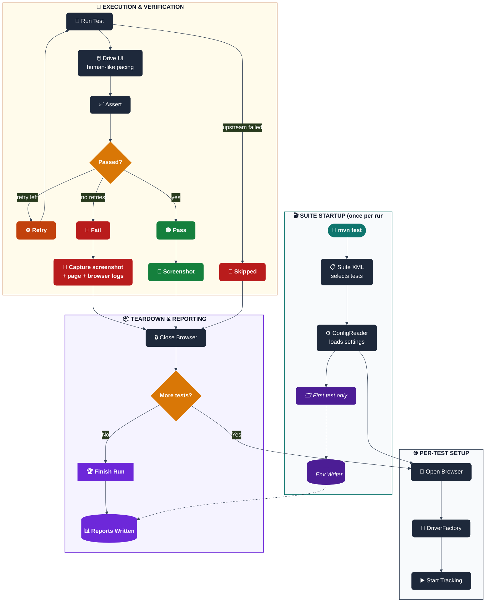

<div align="center">

# 📐 Architecture & Design

*How a test actually runs, end to end — core files, the Page Object pattern, and the Selenium concepts this framework leans on.*

</div>

---

## 📋 Table of Contents
- [🧠 What Is This? (From Scratch)](#-what-is-this-from-scratch)
- [🏗️ Architecture — How a Test Runs](#️-architecture--how-a-test-runs)
- [🔑 Core Files — What Each One Does](#-core-files--what-each-one-does)
- [🩹 Self-Healing Locators](#-self-healing-locators)
- [📄 Page Objects — Pattern Explained](#-page-objects--pattern-explained)
- [🧰 Key Selenium Concepts Used](#-key-selenium-concepts-used)

---

## 🧠 What Is This? (From Scratch)

### 🔰 What is Selenium?
Selenium is a **browser automation library**. It lets your Java code control a real browser — open URLs, click buttons, fill forms, read text — exactly like a human would.

```
Your Java Code  →  Selenium WebDriver  →  ChromeDriver  →  Chrome Browser  →  Website
```

### 🔰 What is TestNG?
TestNG is a **test runner** for Java. It finds your `@Test` methods, runs them in order, tracks pass/fail, and generates reports.

### 🔰 What is Maven?
Maven is a **build tool**. It downloads your dependencies (Selenium, TestNG…) from the internet, compiles your code, and runs your tests — all with one command.

### 🔰 What is the Page Object Model (POM)?
POM is a **design pattern**: every web page gets its own Java class. The class knows how to interact with that page. Tests call the page class — they never interact with the browser directly. This keeps code clean and reusable.

---

## 🏗️ Architecture — How a Test Runs



**🗺️ Legend:**

| Shape / Color | Meaning |
|---|---|
| 🟢 Teal stadium | Start of the flow |
| ⬛ Slate rectangle | A framework step |
| 🟪 Purple rectangle, italic | Runs once per JVM (not per test) |
| 🟧 Orange diamond | A decision point |
| 🟠 Dark-orange rectangle | Retry |
| 🟢 Green rectangle | Pass |
| 🔴 Red rectangle | Fail |
| 🟣 Purple cylinder | Report output written to disk |

**Reading it, in plain terms:**
1. **🎬 Suite startup (once per run)** — `testng-suites/*.xml` decides which tests run, `ConfigReader` loads the settings, and `TestListener` (on the very first test only) has `AllureEnvironmentWriter` save the run's details for later.
2. **🌐 Per-test setup** — `BaseTest` asks `DriverFactory` to open a browser, then `TestListener` starts tracking the test.
3. **🎯 Execution & verification** — the test drives the site through its Page Object, with `HumanActions` adding realistic pacing between actions, then an assertion decides pass or fail. A failure with retries left goes back through `RetryAnalyzer` and runs again; if a required earlier test failed, this one is skipped instead of run at all.
4. **📦 Teardown & reporting** — `TestListener` hands off to `ScreenshotUtil` (always) and `FailureDiagnostics` (failures only, for the page and browser logs), `BaseTest` closes the browser, and the cycle repeats for the next test. Once the suite is done, `TestListener` wraps everything up and the final report files are written.

For the full breakdown of what happens after step 4 — which files get written and what each report shows — see [📈 Test Reports](reports-and-quality.md#-test-reports).

---

## 🔑 Core Files — What Each One Does

A quick-reference map first — expand **📖 Full details** below each group for the deeper explanation (thread-safety notes, gotchas, exact method signatures).

| File | One-line purpose |
|---|---|
| `BaseTest.java` | Opens/closes the browser around every test |
| `BasePage.java` | Parent of every Page Object — shared wait helpers |
| `DriverProvider.java` | Lets a Page Object reach the active browser without owning it |
| `ConfigReader.java` | Reads settings: `global.properties` → `<site>.properties` → `-D` overrides |
| `DriverFactory.java` | Creates the Chrome/Firefox/Edge browser instance |
| `HumanActions.java` | Adds human-like pacing to every click/type |
| `DataProvider` / `DataProviderFactory` / `DataRow` | Feed one test method many rows of data from CSV/JSON/Excel/YAML/ZIP |
| `Keyword*` + `KeywordTestBase` | Run a test case scripted as CSV rows instead of Java |
| `TestListener.java` | Wires every test result into Extent + Allure |
| `FailureDiagnostics.java` | Grabs page source + browser console logs on failure |
| `AllureEnvironmentWriter.java` | Writes the Allure report's Environment + Categories data |
| `ExtentManager.java` | Builds the Extent HTML report |
| `ScreenshotUtil.java` | Takes the pass/fail screenshot |
| `SmartLocator.java` | Tries a locator, falls back to alternates if it breaks |
| `SelfHealingEngine.java` | Auto-recovers a broken locator by DOM-similarity matching, with an optional visual/screenshot-hash fallback (`VisualHasher.java`) |
| `AccessibilityUtils.java` | Runs an axe-core accessibility scan |
| `VisualRegressionUtils.java` | Pixel-diffs a screenshot against a saved baseline |

<details>
<summary><b>📖 Full details — click to expand</b></summary>

### `BaseTest.java`
Parent class that every test extends. Handles browser lifecycle automatically.
```
@BeforeMethod → opens browser, navigates to site URL
@Test         → your test runs here
@AfterMethod  → closes browser, cleans ThreadLocal
```
Uses `ThreadLocal<WebDriver>` so each test thread gets its own browser instance — required for parallel execution. Test classes that manage a single shared session across many `@Test` methods (e.g. a full E2E flow that stays logged in) override `setUp()`/`tearDown()` to no-ops and drive the browser from `@BeforeClass`/`@AfterClass` instead — see `BookStoreApplicationTest` for the pattern.

### `BasePage.java`
Parent class every Page Object extends. Holds the shared `WebDriver`/`WebDriverWait` plumbing (via `DriverProvider`) and common helpers — explicit-wait wrappers, safe-click/safe-type variants — so individual page classes only need to declare locators and page-specific actions, not re-implement wait boilerplate 35 times over.

### `DriverProvider.java`
The bridge between `BaseTest` (which owns the `WebDriver` lifecycle) and Page Objects (which need to *use* that driver without owning it). Page Objects call into `DriverProvider` rather than taking a `WebDriver` constructor argument directly, keeping the thread-local browser instance a single source of truth.

### `ConfigReader.java`
Reads config in three layers, each overriding the previous:
```
global.properties   → base defaults
demoqa.properties   → site-specific overrides
-Dkey=value         → command line wins over everything
```
Call anywhere: `ConfigReader.get("browser")`, `ConfigReader.getInt("timeout", 10)`

### `DriverFactory.java`
Single place that creates the browser. Reads `browser` and `headless` from config. Supports Chrome, Firefox, Edge. Sets download folder to `target/downloads` so downloads work on both local machine and CI. When `GRID_ENABLED=true` is set (see [Docker section](configuration.md#-running-against-a-dockerized-selenium-grid)), points at a remote `GRID_URL` instead of a local driver. For Chromium-based browsers (Chrome/Edge/Brave) it also turns on `goog:loggingPrefs` so the browser's JS console output can be captured — see `FailureDiagnostics.java` below.

### `HumanActions.java`
Wraps every Selenium click and type with random delays. Makes automation look human. All timings come from config so they can be tuned or disabled.
```java
HumanActions.click(driver, locator)        // pause → click
HumanActions.type(driver, locator, text)   // pause → type char by char
HumanActions.pause()                       // random pause min-max ms
HumanActions.postTestPause()               // longer pause after test ends
```
`click()`/`type()` are annotated `@Step`, so every Page Object call — across all 32 page classes, with zero per-page edits — shows up as its own expandable, timestamped step in the Allure report. See [📈 Test Reports](reports-and-quality.md#-test-reports).

### `DataProvider.java` / `DataProviderFactory.java` / `DataRow.java`
The data-driven trio behind `@Test(dataProvider = ...)` methods. `DataProviderFactory` picks the right reader for whichever file extension it's handed (`.csv`, `.json`, `.xlsx`, `.yaml`, or a `.zip` bundling several); `DataProvider` exposes the TestNG-facing `Object[][]`; `DataRow` is the typed wrapper each test method actually receives, so a test doesn't need to know or care which file format backed it. See `LoginDataDrivenTest` for the pattern in use, and [🧵 Keyword-Driven & Data-Driven Testing](testing-guide.md#-keyword-driven--data-driven-testing) below.

### `Keyword.java` / `KeywordStep.java` / `ObjectRepository.java` / `KeywordReader.java` / `KeywordEngine.java` / `KeywordTestBase.java`
The keyword-driven engine — write new test *cases* as data-file rows instead of new Java methods. `Keyword` enumerates supported actions (`CLICK`, `TYPE`, `VERIFY_DISPLAYED`, `SWITCH_TO_FRAME`, ...); `ObjectRepository` loads locators from a `.properties` file (`type:value` pairs) kept separate from both the script and the test; `KeywordReader` groups a script file's rows into ordered `KeywordStep`s per test case; `KeywordEngine` executes that list against the live `WebDriver`; `KeywordTestBase` (extends `BaseTest`) gives test classes the one method they need — `runKeywordTestCase(objectRepo, scriptPath, testCase)`. Full walkthrough, including how to add a new scenario with zero new Java: **[`KEYWORD_DRIVEN_TESTING.md`](../KEYWORD_DRIVEN_TESTING.md)**.

### `TestListener.java`
TestNG calls this at key moments. Drives **both** report engines from one place — Extent (always) and Allure (via the `allure-testng` SPI listener, which auto-registers itself; this class supplies the extra detail Allure doesn't capture on its own).
```
onStart       → writes environment.properties + categories.json (once per JVM)
onTestStart   → creates Extent entry; tags Allure severity + Site/Browser parameters
onTestSuccess → marks green; attaches pass screenshot to Allure
onTestFailure → marks red; attaches failure screenshot + page source + browser
                console logs + failed URL to Allure; embeds screenshot in Extent
onFinish      → flushes Extent HTML to disk; resets singletons for the next site
```
Registered via `@Listeners({TestListener.class, RetryListener.class})` on `BaseTest` — **not** in the suite XML's `<listeners>` block. That ordering matters: registering it through the suite XML instead puts it in a different position relative to Allure's own auto-registered listener, so by the time `onTestFailure` runs, Allure has already closed the test case and silently drops the attachment. Keep it on `BaseTest`.

### `FailureDiagnostics.java`
Best-effort failure forensics, called only from `TestListener.onTestFailure`, never from passing tests. Grabs the full page HTML (`capturePageSource`) and, for Chromium browsers only, the browser's JS console output since the last check (`captureBrowserConsoleLogs`). Both methods swallow their own exceptions — a browser that's already crashed, or a Firefox session with no console-log endpoint, must never turn a genuine test failure into a secondary `NullPointerException` inside the listener itself.

### `AllureEnvironmentWriter.java`
Writes two files Allure doesn't generate on its own straight into `target/allure-results`, once per JVM: `environment.properties` (feeds the report's **Environment** widget — site, browser, OS, Java version, retry count) and `categories.json` (feeds the **Categories** tab, auto-bucketing failures into Product Defects / Element-not-found / Timeouts / Driver issues / Skipped). `reset()` clears the "already written" flag so a second site's run in the same JVM (Jenkins looping over sites) regenerates its own environment file instead of keeping the first site's values.

### `ExtentManager.java`
Singleton that creates one shared HTML report per test run. Saves to `target/extent-reports/<site>-report.html`.

### `ScreenshotUtil.java`
Takes a PNG screenshot (as bytes, and as base64 for embedding) on test pass or failure. Called automatically by `TestListener` — never call manually.

### `SmartLocator.java`
Tries a primary `By` locator, then falls back to one or more alternates before giving up — absorbs the class of breakage this framework has hit repeatedly in practice (a third-party site swapping one widget implementation for another under the same visible UI, e.g. demoqa's Check Box widget silently swapping `react-checkbox-tree` for `rc-tree`). Optional to use — a Page Object can still take a single hardcoded `By` where the markup is stable; reach for `SmartLocator` on elements that have already broken once. Its own primary-locator lookup goes through `SelfHealingEngine` too (see below), so even the "primary" candidate gets one automatic recovery attempt before SmartLocator moves on to an explicit fallback.

### `SelfHealingEngine.java` / `LocatorRepository.java`
The automatic, framework-wide counterpart to `SmartLocator`. Full explanation: [🩹 Self-Healing Locators](#-self-healing-locators) below.

### `AccessibilityUtils.java`
Thin wrapper around [axe-core](https://www.deque.com/axe/) (Deque's accessibility engine) for Selenium. Runs a WCAG/GIGW-adjacent scan against the current page and returns violations bucketed by severity (`critical`, `serious`, `moderate`, `minor`). Config-driven: `a11y.enabled` turns scanning on/off, `a11y.failOn` (default `critical,serious`) decides which severities actually fail the test versus just get logged/attached to Allure. See [♿🖼️⏱️ Specialized Testing](testing-guide.md#️️-specialized-testing--accessibility-visual-regression--performance) below.

### `VisualRegressionUtils.java`
Thin wrapper around [AShot](https://github.com/pazone/ashot) for pixel-level screenshot diffing. First run for a given snapshot name captures and saves a baseline image (always passes); every run after that diffs the current screenshot against the committed baseline and fails if the difference exceeds a configurable threshold. See [♿🖼️⏱️ Specialized Testing](testing-guide.md#️️-specialized-testing--accessibility-visual-regression--performance) below.

</details>

---

## 🩹 Self-Healing Locators

Every locator in this framework eventually goes through one of three chokepoints: `BasePage.waitVisible`/`waitClickable`, `HumanActions.click`/`type` (the two most-used interaction methods — 218 call sites across 32 page classes), or `KeywordEngine`'s own element resolution. As of this feature, all three route through `SelfHealingEngine` instead of a bare `wait.until(ExpectedConditions...)` — so every existing Page Object gets self-healing for free, with zero per-page changes.

**How it heals, in order:**

1. Try the locator normally, with the caller's own configured timeout.
2. **On success** — snapshot the element's identifying attributes (tag, `id`, `name`, class list, visible text, a handful of common attributes like `role`/`aria-label`/`data-testid`, and its parent tag) into an `ElementFingerprint`, and store it in `LocatorRepository` keyed by *page URL + locator*.
3. **On failure** (`TimeoutException`) — look up the fingerprint saved the last time that exact locator succeeded (this run, or a previous one — the repository is loaded from disk at startup), scan the live DOM for elements sharing the same tag, and score each one against the fingerprint (**DOM stage**):

| Signal | Weight |
|---|---|
| `id` exact match | 30% |
| `name` exact match | 20% |
| Class-list overlap (Jaccard similarity) | 20% |
| Visible-text similarity (normalized edit distance) | 15% |
| Tracked attributes (`type`, `placeholder`, `aria-label`, `role`, `href`, `title`, `data-testid`) | 10% |
| Same parent tag | 5% |

4. If the best DOM candidate clears `self-healing.threshold` (default `0.55`), the engine uses it immediately — no screenshots taken. **Otherwise**, if `self-healing.visual.enabled=true` and the baseline has a stored screenshot hash, a **visual stage** kicks in (`VisualHasher`): it screenshots a small, targeted pool of candidates — the strongest DOM near-misses, or (only when DOM scoring found nothing at all, i.e. the element's *tag itself* changed) a broader scan of common interactive elements (`button`, `a`, `input`, `[role='button']`, etc.) — computes a perceptual difference-hash (dHash) of each, and blends that similarity with the candidate's DOM score. This is what lets healing recover an icon-only button with no id/name/stable text, or a `<button>` refactored into a `<div role="button">` — cases the DOM stage structurally can't match. If the best result from either stage clears the threshold, the engine uses it, logs a `WARNING` (so the drift is visible even though the test still passes), and records the heal — tagged `dom` or `visual` — for the end-of-run report. If nothing clears the threshold — or nothing was ever fingerprinted for that locator in the first place — the original `TimeoutException` propagates exactly as it always did. Healing only ever recovers a run; it never invents a match that isn't really there.

Visual healing is **off by default** because capturing a screenshot hash happens at fingerprint-capture time (step 2 above) — on every successful find, not just on a heal — and `find`/`findClickable` run on effectively every page interaction across ~34 page objects. Turn it on (`-Dself-healing.visual.enabled=true`) for suites where recovering those DOM-invisible cases is worth the added per-find screenshot cost.

**Where the output goes:**
- `self-healing-data/locator-repository.json` — the fingerprint store, persisted between runs so healing works from the *first* locator failure of a fresh run, not just after this run has already seen the element once. Deliberately outside `target/`, which `mvn clean` wipes before every run.
- `target/self-healing/healing-report.json` — written only if at least one heal happened; a flat list of `{elementKey, originalLocator, healedDescription, score, matchMethod, timestamp}` (`matchMethod` is `dom` or `visual`), meant to be reviewed (or wired into CI as a build artifact) so a locator that quietly drifted still gets fixed properly instead of staying invisible behind a passing test.

**Config** (`global.properties`, all overridable with `-Dkey=value`):

| Key | Default | Meaning |
|---|---|---|
| `self-healing.enabled` | `true` | Master switch. `false` restores plain fail-on-first-miss behavior. |
| `self-healing.threshold` | `0.55` | Minimum similarity score (DOM or blended DOM+visual) to accept a healed match. |
| `self-healing.repository.path` | `self-healing-data/locator-repository.json` | Where fingerprints persist between runs. |
| `self-healing.report.path` | `target/self-healing/healing-report.json` | Where the end-of-run heal summary is written. |
| `self-healing.visual.enabled` | `false` | Turns on the screenshot-hash fallback stage (and the extra per-find screenshot needed to capture its baseline). |
| `self-healing.visual.weight` | `0.5` | How much the visual similarity counts vs. the DOM score once the visual stage runs (`0.0` = visual score ignored, `1.0` = DOM score ignored). |

**What this is not:** it can't heal a locator that has *never* successfully resolved (no fingerprint to compare against — a typo in a brand-new locator still fails immediately, as it should), and it isn't visual/screenshot matching — purely DOM attribute/text/structure similarity. For a locator you already know is fragile and want an explicit, hand-picked (not scored) fallback for, `SmartLocator` is still the right tool — see above.

---

## 📄 Page Objects — Pattern Explained

Every webpage has its own Java class. Locators and actions live in the page class. Tests only call page methods — no locators ever appear in test files.

```java
// Page Object — knows HOW to interact with the page
public class TextBoxPage {
    private final By userName = By.id("userName");   // locator

    public void fillForm(String name) {               // action
        HumanActions.type(driver, userName, name);
    }

    public String getOutputName() {                   // getter
        return driver.findElement(outputName).getText();
    }
}

// Test — describes WHAT to verify
public class TextBoxTest extends BaseTest {
    @Test
    public void fillTextBoxForm() {
        TextBoxPage page = new TextBoxPage(getDriver());
        page.fillForm("Amit");                         // no locators here
        Assert.assertTrue(page.getOutputName().contains("Amit"));
    }
}
```

<details>
<summary><strong>Helpers in Page Objects</strong> — private methods that keep public methods clean</summary>

```java
// Helper — private, called only inside this class
private void scrollAndClick(By locator) {
    js.executeScript("arguments[0].scrollIntoView({block:'center'});", el);
    js.executeScript("arguments[0].click();", el);
}

// Public methods use helper — no duplication
public void selectSports()  { scrollAndClick(sportsLabel);  }
public void selectReading() { scrollAndClick(readingLabel); }
```
</details>

<details>
<summary><strong>Helpers in Test Classes</strong> — group related steps for shorter, readable tests</summary>

```java
private PracticeFormPage openForm() {
    PracticeFormPage page = new PracticeFormPage(getDriver());
    page.navigateToPracticeForm();
    return page;
}

private void fillPersonalDetails(PracticeFormPage page) {
    page.enterFirstName("Amit");
    page.enterLastName("Thakor");
    page.selectGender("male");
    page.enterMobile("9876543210");
}

@Test
public void verifyFormSubmission() {
    PracticeFormPage page = openForm();   // helper
    fillPersonalDetails(page);            // helper
    page.submitForm();
}
```
</details>

---

## 🧰 Key Selenium Concepts Used

A copy-paste cheat sheet of every Selenium technique this framework relies on — locators, waits, JS execution, Actions, alerts, frames, windows, dropdowns, ARIA. Collapsed by default since it's reference material, not something to read top-to-bottom.

<details>
<summary><b>📖 Expand the full cheat sheet</b></summary>

### Locator types
```java
By.id("userName")                          // fastest, most reliable
By.xpath("//h5[text()='Elements']")        // flexible, finds by text
By.cssSelector(".modal-body")              // CSS class/attribute
By.className("text-success")               // single class only
By.linkText("Click Here")                  // exact link text
By.xpath("//a[normalize-space()='Menu']")  // trims whitespace before matching
```

### Wait strategies
```java
// Wait for element to be visible (exists AND displayed)
wait.until(ExpectedConditions.visibilityOfElementLocated(locator));

// Wait for element to be clickable (visible AND enabled)
wait.until(ExpectedConditions.elementToBeClickable(locator));

// Wait for element to disappear
wait.until(ExpectedConditions.invisibilityOfElementLocated(locator));

// Wait for custom condition using lambda — also the pattern used for
// "poll until this async UI update lands" (see Debugging section above)
wait.until(d -> d.findElement(locator).getAttribute("aria-valuenow").equals("100"));

// Wait for number of windows/tabs
wait.until(ExpectedConditions.numberOfWindowsToBe(2));

// Wait for a native JS alert to appear (does NOT catch in-page modals — see Debugging section)
wait.until(ExpectedConditions.alertIsPresent());
```

### JavaScript execution
```java
JavascriptExecutor js = (JavascriptExecutor) driver;

js.executeScript("arguments[0].click();", element);                        // JS click — bypasses ad banner
js.executeScript("arguments[0].scrollIntoView({block:'center'});", el);   // scroll to center
js.executeScript("window.scrollTo(0, 0)");                                 // scroll to top
js.executeScript("arguments[0].value=arguments[1];", el, 50);             // set value directly
js.executeScript("arguments[0].dispatchEvent(new Event('input'));", el);   // fire React event
```

### Actions class — advanced mouse/keyboard
```java
// Hover
new Actions(driver).moveToElement(element).perform();

// Hover with pause (required for CSS menus)
new Actions(driver).moveToElement(element).pause(Duration.ofMillis(1000)).perform();

// Double click
new Actions(driver).doubleClick(element).perform();

// Right click
new Actions(driver).contextClick(element).perform();
```

### Alert handling
```java
Alert alert = wait.until(ExpectedConditions.alertIsPresent());
String message = alert.getText();   // read alert text
alert.accept();                     // click OK
alert.dismiss();                    // click Cancel
alert.sendKeys("Amit");             // type into prompt input
```

### Frame switching
```java
driver.switchTo().frame(frameElement);  // enter iframe — now find elements inside
driver.switchTo().defaultContent();     // back to main page from any depth

// Nested frames — must go through parent to reach child
driver.switchTo().frame(parentFrame);
driver.switchTo().frame(childFrame);
driver.switchTo().defaultContent();     // one call gets all the way back
```

### Window/tab switching
```java
Set<String> before = driver.getWindowHandles();   // handles before click
// click something that opens new window
for (String handle : driver.getWindowHandles()) {
    if (!before.contains(handle)) {
        driver.switchTo().window(handle);          // switch to new window
        break;
    }
}
// do work in new window
driver.close();                                    // close new window
String remaining = driver.getWindowHandles().iterator().next();
driver.switchTo().window(remaining);               // switch back
```

### Select class — plain HTML dropdowns only
```java
Select dropdown = new Select(driver.findElement(By.id("oldSelectMenu")));
dropdown.selectByVisibleText("Blue");         // by visible text
dropdown.selectByValue("blue");               // by value attribute
dropdown.selectByIndex(2);                    // by position (0-based)
dropdown.getFirstSelectedOption().getText();  // read selected value
```

### ARIA attributes — used by progress bars, sliders
```java
element.getAttribute("aria-valuenow")   // current value
element.getAttribute("aria-valuemin")   // minimum value
element.getAttribute("aria-valuemax")   // maximum value
element.getAttribute("aria-expanded")   // true/false — is expanded
element.getAttribute("aria-selected")   // true/false — is selected
```

</details>

---

<div align="center">

<sub>⬆️ <a href="#-architecture--design">Back to top</a> · <a href="../README.md">← Back to README</a></sub>

</div>
