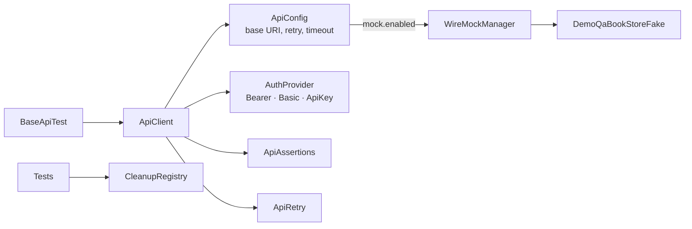

# API Testing Layer

> [!abstract] A small REST framework on Rest-Assured — client, config, pluggable auth, assertions, retry, cleanup, contract schemas — plus WireMock mocking and API-seeded UI tests.

**Part of:** [[Selenium Framework Hub]]  ·  **Layer:** API / mock / perf

Lives in `src/test/.../core/api` (Rest-Assured is test-scoped).

| Test class | What |
|---|---|
| `BookStoreApiTest` | 9 dependency-chained calls: create user → token → authorized → books → book → add → read → remove → delete (`204`, not Swagger's `200`) |
| `BookStoreApiNegativeTest` | 11 error-path tests |
| `ApiResilienceMockedTest` | 500, 503-then-200, persistent failure, slow response vs budget |
| `ProfileApiSeededTest` | per-test account + book created over REST **before** the browser starts |
| `JsonPlaceholderApiTest` | API-only site, 9 tests |

**Contract schemas** (`src/test/resources/schemas/`): `account-created`, `book-detail`, `books-list`, `post`, `user-detail`. Every call is attached to Allure (request, response, timing) via the `AllureRestAssured` filter.

## Connections

- **Depends on →** [[ApiClient]] · [[ApiConfig]] · [[ApiAssertions]] · [[ApiRetry]] · [[API Auth Providers]] · [[CleanupRegistry]] · [[BaseApiTest]] · [[WireMockManager]]
- **Related ↔** [[DemoQA]] · [[JsonPlaceholder]] · [[Performance Testing]]
