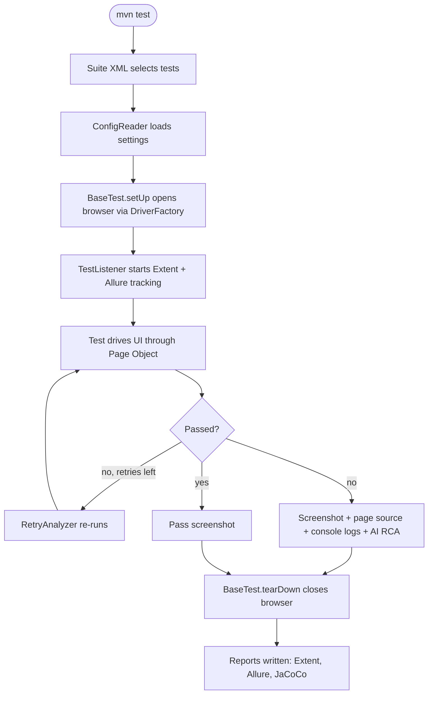

# Architecture and Test Lifecycle

> [!abstract] How one test runs end to end: suite XML → config → browser → listener tracking → Page Object actions → assertion → retry / evidence → teardown → reports.

**Part of:** [[Selenium Framework Hub]]  ·  **Layer:** Core framework

## Four phases

1. **Suite startup (once per run)** — `testng-suites/*.xml` picks tests; [[TestSelection]] drops anything switched off in [[test-config properties|test-config.properties]]; [[ConfigReader]] validates the site against [[SiteRegistry]] and loads layered config; the first test makes [[AllureEnvironmentWriter]] write environment + categories.
2. **Per-test setup** — [[BaseTest]] asks [[DriverFactory]] for a browser (local, Grid or Appium); [[TestListener]] starts tracking and optionally [[VideoRecorder]].
3. **Execution & verification** — the test calls Page Object methods ([[BasePage]], [[HumanActions]]) whose element lookups pass through [[SelfHealingEngine]]; an assertion decides pass/fail; [[RetryAnalyzer]] reruns non-deterministic failures; dependent tests are skipped.
4. **Teardown & reporting** — [[ScreenshotUtil]] always, [[FailureDiagnostics]] on failure, optional [[AiExceptionAnalyzer]]; browser closed; [[ExtentManager]] flushes; CI merges JaCoCo and builds Allure.

## Key invariants
- `ThreadLocal<WebDriver>` per test thread → safe `parallel="classes"`.
- `TestListener` is registered via `@Listeners` on `BaseTest`, **not** in suite XML (Allure ordering bug).
- `RetryListener` is the opposite: it must be in the suite XML because it is an `IAnnotationTransformer`.

## Connections

- **Depends on →** [[BaseTest]] · [[DriverFactory]] · [[ConfigReader]] · [[TestListener]] · [[BasePage]] · [[SelfHealingEngine]] · [[RetryAnalyzer]]
- **Related ↔** [[Test Execution Runtime]] · [[Core Framework]] · [[Reporting and Observability]]
