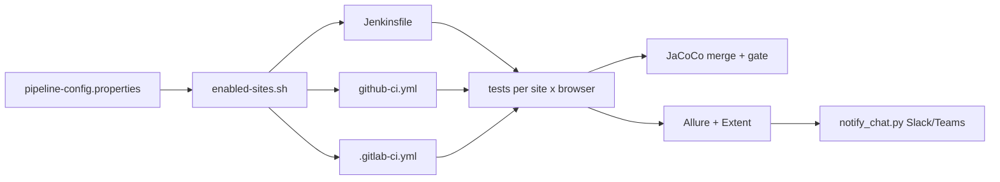

# CI-CD Pipelines

> [!abstract] Three parallel pipelines — Jenkins, GitHub Actions, GitLab CI — driven by the same two config files and the same helper scripts.

**Part of:** [[Selenium Framework Hub]]  ·  **Layer:** CI / CD

| Capability | Jenkins | GitHub Actions | GitLab CI |
|---|---|---|---|
| Build / Checkstyle / unit tests | ✔ (UNSTABLE on fail) | ✔ jobs | ✔ jobs |
| Secret scan (gitleaks) | UNSTABLE | continue-on-error + full-history job | allow_failure |
| Test Impact Analysis | stage | job + `coverage-map` | MR job |
| Site × browser matrix | `ALL_BROWSERS` | matrix (+ Safari on macOS) | `parallel:matrix` |
| API tests / perf (Java DSL) | stages | jobs | jobs |
| Mobile (emulator) | stage | job | job (`resource_group`) |
| Nightly a11y+visual, perf smoke, OWASP | cron | `schedule` | schedules |
| Coverage gate (50% core) | UNSTABLE | job fails | job fails |
| Published report | Allure plugin + HTML Publisher | Pages with trend history | GitLab Pages |
| Chat notification | `post { always }` | `notify` job | `notify` job |

Common: [[pipeline-config properties|pipeline-config.properties]] site switch · [[Segmented Reports]] · [[CI Python Scripts]] · [[Secret Scanning]] · [[JaCoCo Coverage Gate]] · [[Test Impact Analysis]].

## Connections

- **Depends on →** [[Jenkins Pipeline]] · [[GitHub Actions Pipeline]] · [[GitLab CI Pipeline]] · [[enabled-sites script]] · [[CI Python Scripts]] · [[Chat Notifications]] · [[gh-pages Retention]] · [[Secret Scanning]] · [[JaCoCo Coverage Gate]]
- **Related ↔** [[Docker and Selenium Grid]] · [[Mobile Appium Module]] · [[pipeline-config properties]] · [[Quality Gates]]
