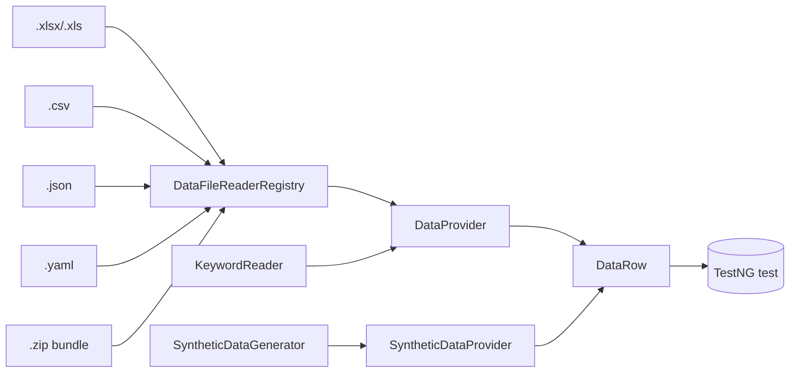

# Data-Driven Testing

> [!abstract] One `DataRow` shape from five file formats (Excel · CSV · JSON · YAML · ZIP) plus synthetic DataFaker data — feeds any TestNG `@Test(dataProvider=…)`.

**Part of:** [[Selenium Framework Hub]]  ·  **Layer:** Data-driven

- **Filters** (in [[global properties|global.properties]]): `data.tags=smoke,regression` keeps only rows whose `tags` column matches; `data.execute.column=execute` skips rows resolving to `no/false/0/skip`.
- The same loader backs the [[Keyword-Driven Testing]] scripts ([[KeywordReader]]).
- Reference tests: `LoginDataDrivenTest` (saucedemo), `RegistrationSyntheticDataTest` (demoqa).
- Test data: `login.csv / .json / .xlsx / .yaml / .zip` — the *same* data in all five formats.

## Connections

- **Depends on →** [[DataProvider]] · [[DataRow]] · [[Data File Readers]] · [[SyntheticDataGenerator]]
- **Related ↔** [[Keyword-Driven Testing]] · [[SauceDemo]] · [[DemoQA]]
