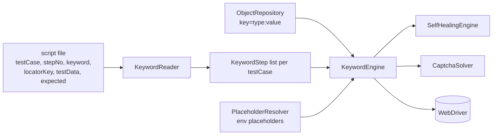

# Keyword-Driven Testing

> [!abstract] Write test cases as CSV/Excel/JSON/YAML rows instead of Java — keywords resolved against a locator Object Repository.

**Part of:** [[Selenium Framework Hub]]  ·  **Layer:** Keyword-driven

**Vocabulary (26 keywords):** `NAVIGATE` `CLICK` `TYPE` `SET_TEXT` `CLEAR` `SELECT_BY_TEXT` `SELECT_BY_VALUE` `HOVER` `SCROLL_TO` `WAIT_SECONDS` `PRESS_KEY` `VERIFY_TEXT` `VERIFY_DISPLAYED` `VERIFY_NOT_DISPLAYED` `VERIFY_URL_CONTAINS` `VERIFY_TITLE_CONTAINS` `SWITCH_TO_FRAME` `SWITCH_TO_DEFAULT_CONTENT` `ACCEPT_ALERT` `DISMISS_ALERT` `WAIT_FOR_PAGE_LOAD` `SOLVE_TEXT_CAPTCHA` `SOLVE_MATH_CAPTCHA` `SOLVE_CAPTCHA_WITH_AI` `SOLVE_TEXT_CAPTCHA_IF_PRESENT` `SCREENSHOT`.

**Add a scenario** → new `testCase` block in the CSV. **Add a locator** → one line in `objectrepository/<site>.properties`. **Keyboard-only flows** via `PRESS_KEY`.

Working examples: saucedemo login (3 cases), demoqa Text Box, SAHMAT login + forgot-password.

## Connections

- **Depends on →** [[Keyword]] · [[KeywordEngine]] · [[KeywordReader]] · [[ObjectRepository]] · [[PlaceholderResolver]] · [[KeywordTestBase]]
- **Related ↔** [[Data-Driven Testing]] · [[SAHMAT]] · [[SauceDemo]]
