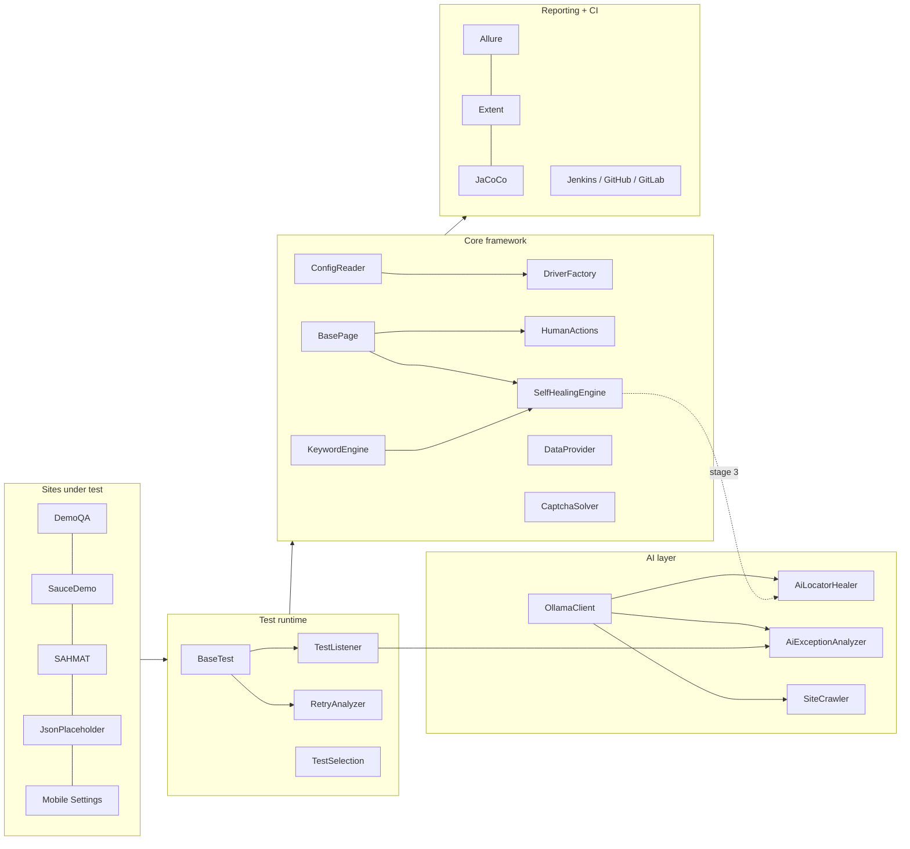

# Selenium Framework Hub

> [!abstract] Production-grade, multi-site Java test automation framework — Selenium 4.21 + TestNG 7.9 + Maven on Java 17 — with dual reporting, 5 data formats, keyword-driven scripting, self-healing, AI assists, Dockerized Grid and triple CI/CD.

**Layer:** Root

## At a glance

| | |
|---|---|
| **Language / build** | Java 17 · Maven 3.9+ (Maven Wrapper included) |
| **Runner** | TestNG 7.9.0 — parallel-ready, retry-aware, group-driven (`smoke`, `regression`, `api`, `perf`, `accessibility`, `visual`, `keyword-driven`, `data-driven`, `synthetic-data`) |
| **Browsers** | Chrome · Firefox · Edge · Brave · Safari (macOS only, no headless) + Appium Android/iOS |
| **Pattern** | Page Object Model + reusable components + 3 test styles (standard / keyword / data-driven) |
| **Sites** | demoqa · saucedemo · SAHMAT · jsonplaceholder (API-only) · Android Settings (mobile) |
| **Codebase** | 218 Java files · ~30.6k LOC · 316 `@Test` annotations · 23 TestNG suites |
| **Biggest files** | `CaptchaSolver` 4,022 LOC · `DriverFactory` 1,375 · `SelfHealingEngine` 616 · `TestListener` 611 · `SiteCrawler` 521 · `MobileAppCrawler` 475 · `KeywordEngine` 425 |
| **Reporting** | Allure (interactive, history) + Extent (self-contained) + optional ReportPortal live stream |
| **CI/CD** | Jenkinsfile · GitHub Actions · GitLab CI — all three runnable as-is |

## The map

## Explore by layer

- **How a test runs** → [[Architecture and Test Lifecycle]] · [[Project Structure]] · [[Tech Stack]]
- **Engine room** → [[Core Framework]] · [[Test Execution Runtime]] · [[Configuration System]]
- **Test styles** → [[Test Types and Suites]] · [[Data-Driven Testing]] · [[Keyword-Driven Testing]]
- **Resilience** → [[Self-Healing Locators]] · [[CAPTCHA Solving]] · [[AI Features]]
- **Non-UI testing** → [[API Testing Layer]] · [[Performance Testing]]
- **Smart selection** → [[Test Impact Analysis]]
- **Evidence** → [[Reporting and Observability]]
- **Targets** → [[Sites Under Test]] · [[Mobile Appium Module]]
- **Automation around it** → [[CI-CD Pipelines]] · [[Docker and Selenium Grid]] · [[Automation Console]] · [[Scripts and Tooling]]
- **Governance** → [[Quality Gates]] · [[Roadmap]] · [[Conventions and Troubleshooting]]

## Design philosophy (recurring ideas across the code)

1. **One chokepoint per concern** — config, driver creation, waits, healing, reporting each live in exactly one class so every Page Object inherits them for free.
2. **Opt-in, report-only for anything risky** — AI, visual healing, video, mutation testing, security scan all default to *off* or *non-blocking*.
3. **Fail open for tests, fail closed for sites** — `test-config.properties` never silently drops a test; `pipeline-config.properties` refuses a disabled site.
4. **Never let diagnostics break the test** — every evidence/AI/CAPTCHA helper swallows its own exceptions.
5. **One config, three layers** — `global.properties` → `<site>.properties` → `-Dkey=value`.

## Connections

- **Related ↔** [[Vault Guide]]
