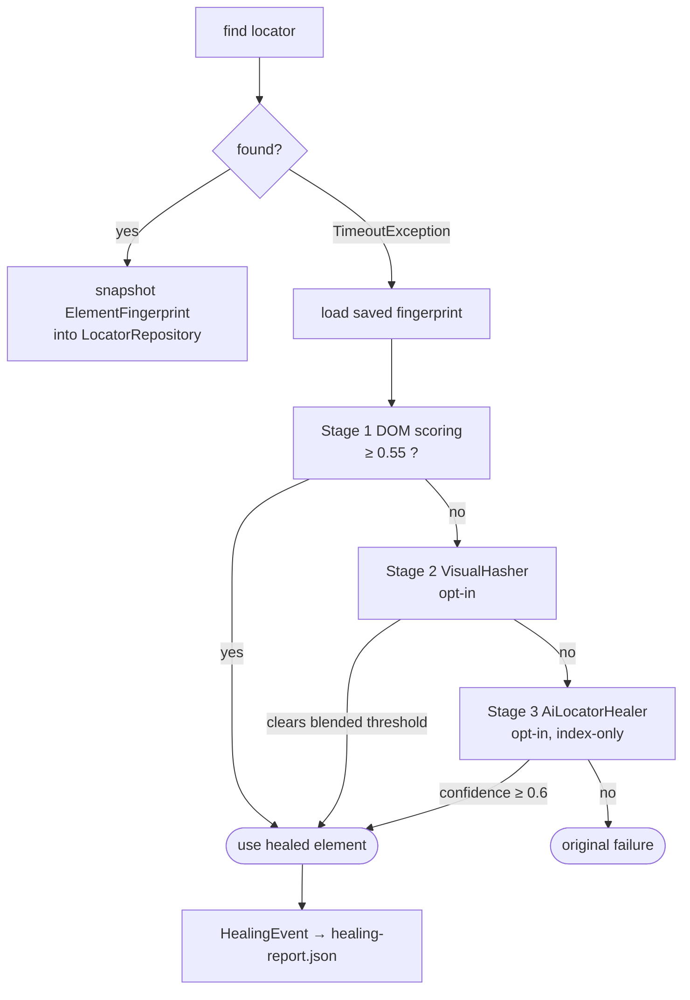

# Self-Healing Locators

> [!abstract] Automatic recovery of locators that used to work — DOM similarity → visual hash → AI pick — applied to every Page Object with zero edits.

**Part of:** [[Selenium Framework Hub]]  ·  **Layer:** Self-healing

**Entry points (all route to [[SelfHealingEngine]]):** `BasePage.waitVisible/waitClickable` · `HumanActions.click/type` · `KeywordEngine` · `SmartLocator` last resort.

**Cannot heal** a locator that has *never* succeeded (no fingerprint) — a typo in a brand-new locator still fails immediately.

## Connections

- **Depends on →** [[SelfHealingEngine]] · [[LocatorRepository]] · [[VisualHasher]] · [[AiLocatorHealer]] · [[Healing Report Output]]
- **Related ↔** [[SmartLocator]] · [[AI Features]] · [[global properties]]
