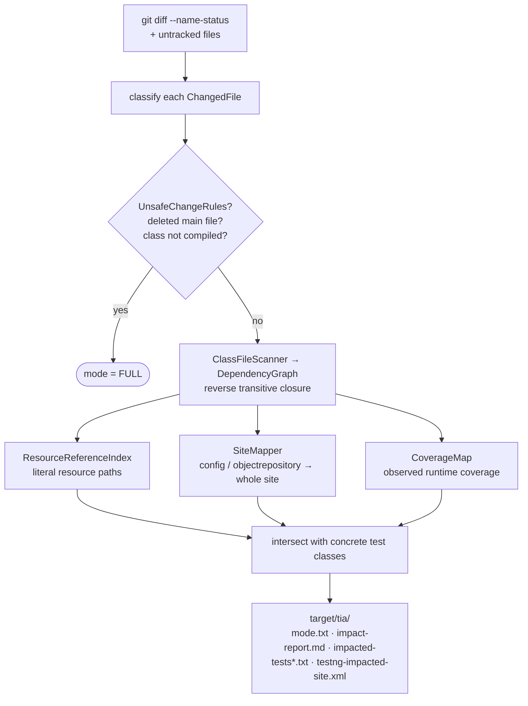

# Test Impact Analysis

> [!abstract] Run only the test classes a code change actually affects: git diff → compiled-class dependency graph → impacted tests, with a coverage-based safety net and conservative FULL-run rules.

**Part of:** [[Selenium Framework Hub]]  ·  **Layer:** Test impact analysis

**Why per-site output:** one `mvn test` is one `-Dsite`, so output is grouped per site and the script loops once per affected site.

**Principle:** a false negative (skipping a test that should run) is far worse than a false positive — hence the *over-inclusive* constant-pool graph.

**CLI:** `./Scripts/test-impact-analysis.sh --base origin/main [--head HEAD] [--run] [--browser …]` · or `mvn -q exec:java@tia -Ptia -Dtia.base=origin/main`.

**CI:** GitHub `test-impact-analysis` + `coverage-map` jobs · GitLab MR-triggered `test-impact-analysis` (`GIT_DEPTH: "0"`) · Jenkins *Test Impact Analysis* stage · dashboard tile *TIA selected (impacted/total)*.

**Tests:** 10 JUnit 5 classes under `core/tia` run by `mvn verify -Punit-tests` (real temp git repo + real `javac` output, no mocks).

## Connections

- **Depends on →** [[TestImpactAnalyzer]] · [[GitDiffReader]] · [[ClassFileScanner]] · [[DependencyGraph]] · [[UnsafeChangeRules]] · [[ResourceReferenceIndex]] · [[SiteMapper]] · [[Coverage Map Pipeline]] · [[TIA Reports and CLI]] · [[TIA Support Classes]]
- **Related ↔** [[test-impact-analysis script]] · [[CI-CD Pipelines]] · [[Unit Tests Profile]]
