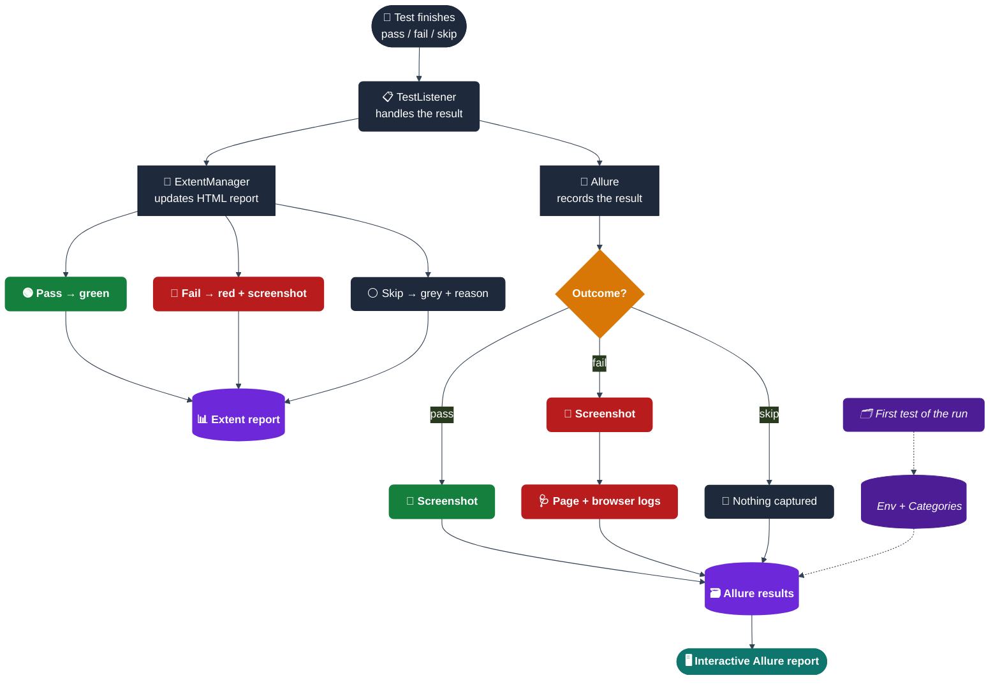

# Reports & Code Quality

## 📈 Test Reports

```
target/
├── extent-reports/
│   └── demoqa-report.html         # Custom HTML report — open in Chrome
├── allure-results/                # Raw Allure results — feed to `allure serve` or CI's Allure step
│   ├── environment.properties     # Written by AllureEnvironmentWriter → powers the Environment widget
│   ├── categories.json            # Written by AllureEnvironmentWriter → powers the Categories tab
│   └── *-result.json              # One per test, written by the allure-testng listener
├── screenshots/
│   └── TestName_20260704.png      # Auto-captured on failure (local file copy)
├── debug-dumps/
│   └── *.html                     # Full page-source dumps written when a locator times out
└── surefire-reports/
    └── *.xml                      # Raw XML consumed by Jenkins/GitLab
```

### How a result becomes two reports



**Reading it, in plain terms:** every test result goes down two paths at once — Extent (a single self-contained HTML file, good for a quick pass/fail skim) and Allure (result files that get rendered into an interactive site). On the very first test of a run, `TestListener` also has `AllureEnvironmentWriter` save two extra files so the eventual report knows what environment it ran in and how to auto-categorize failures. A failing test gets more captured than a passing one — a screenshot plus the full page and browser logs — so most failures can be triaged from the report alone, without re-running the test locally.

### Extent Report — `target/extent-reports/<site>-report.html`
Open directly in any browser. Shows:
- Pass/fail per test with timestamps and duration
- Failure screenshots embedded inline (base64 — no broken image paths if you zip/move the report)
- System info panel: browser, site, headless mode, OS, Java version, retry count
- Summary charts showing overall pass/fail ratio

### Allure Report — interactive, with history/trends
```bash
allure serve target/allure-results     # spins up a local server and opens it
# or, for a static folder you can host/archive:
mvn allure:report                      # writes target/allure-report/
```
What you get that Extent doesn't have:
- **Step-by-step timeline per test** — every `HumanActions.click()`/`type()` call shows up as its own expandable step (locator, typed text, timestamp), not just a single pass/fail line
- **Click-to-enlarge screenshots** — this is native to Allure's report UI; every attached image opens in a full-size lightbox when clicked, no extra config needed
- **Environment widget** — site/browser/OS/Java/retry count for the whole run, from `environment.properties`
- **Categories tab** — failures pre-sorted into *Product defects*, *Element not found / stale*, *Timeouts*, *Driver / infrastructure issues*, and *Skipped*, so a big regression run can be triaged by category instead of one test at a time
- **Severity labels** — tests in the `smoke` group show as `critical`, everything else as `normal`
- **History/trend graphs** — accumulate automatically across runs if you keep copying the previous run's `history/` folder back into `allure-results` before regenerating

### What gets attached, by outcome

| Outcome | Extent | Allure |
|---|---|---|
| ✅ Pass | Pass log | Screenshot |
| ❌ Fail | Fail log + stack trace + screenshot (inline) | Screenshot + page source (HTML) + browser console logs + Failed URL parameter |
| ⏭️ Skip | Skip log + reason | *(no attachment)* |

---

## 📊 Code Coverage — JaCoCo

Every `mvn test` run also produces a coverage report — no separate command needed:

```bash
mvn test
open target/site/jacoco/index.html   # macOS
# or: xdg-open target/site/jacoco/index.html   # Linux
```

`jacoco-maven-plugin` runs in two steps, both bound to the `test` phase:
1. **`prepare-agent`** attaches a Java agent at JVM startup that records which lines/branches actually execute while TestNG runs.
2. **`report`** turns that recorded data into the HTML report above — line/branch coverage per package and class, down to which specific lines a given test hit.

One wiring detail if you ever touch Surefire's config: this project's `<argLine>` is a literal, hardcoded block (AspectJ weaver + logging config + heap flags), not a reference to the default `@{argLine}` property. JaCoCo's `prepare-agent` is configured to write its instrumentation flags into a separate `jacocoArgLine` property instead — using the default property name there would have silently overwritten the whole hardcoded block instead of adding to it. If you add more Surefire config later, keep referencing `@{jacocoArgLine}` explicitly rather than switching back to `@{argLine}`.

There's currently no minimum-coverage threshold enforced — the report is informational only, not a build gate. Adding a `jacoco:check` execution with a minimum (e.g. 50% line coverage on `core`) is on the [roadmap](roadmap.md).

---

## 🧹 Code Quality — Checkstyle

A static-analysis gate, separate from and unrelated to running tests — Checkstyle scans `.java` source for style/bug patterns without compiling or executing anything. It's bound to the `verify` phase, not `test`, so it's opt-in:

```bash
mvn test     # compiles + runs everything — Checkstyle does NOT run
mvn verify   # runs everything `test` does, PLUS Checkstyle
```

Maven's lifecycle is sequential — `verify` includes every phase before it, so this only adds a gate on top; it never replaces the test run. Ruleset lives in `checkstyle.xml` (project root) and deliberately stays practical rather than exhaustive:

| Catches | Skips on purpose |
|---|---|
| Unused/duplicate imports, star imports (with test-annotation exceptions) | Line length / indentation — this project's Rest-Assured chains and Swagger URLs run long by design |
| Missing braces, empty blocks, nested blocks | Full Javadoc coverage |
| `equals`/`hashCode` bugs, `==` on Strings, empty/duplicate `switch` defaults | Naming conventions |

Configured as `violationSeverity=warning` with `failsOnError=true` — real problems fail `mvn verify`, but the ruleset isn't strict enough to demand a rewrite for cosmetic drift.

---

