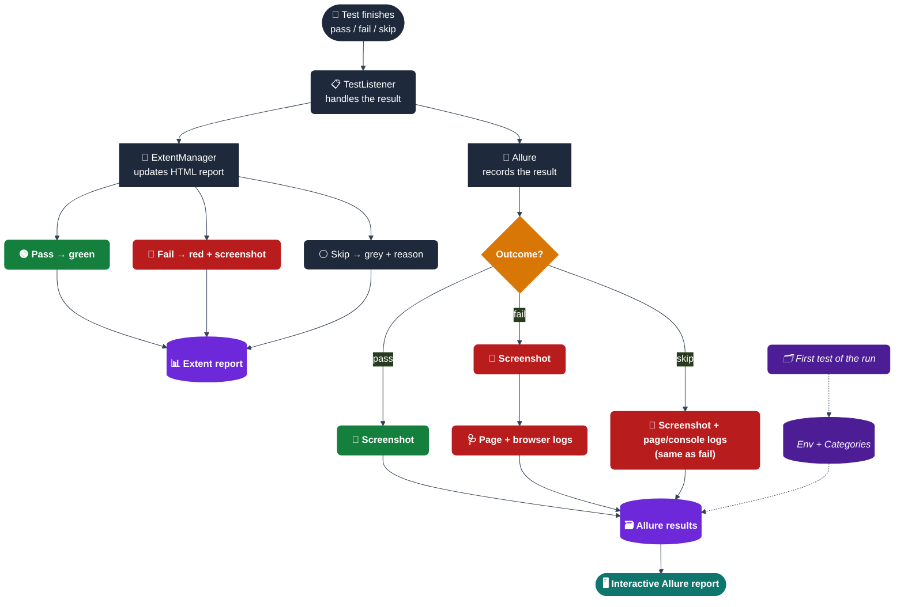

<div align="center">

# 📈 Reports & Code Quality

</div>

---

## 📋 Table of Contents
- [📈 Test Reports](#-test-reports)
- [📡 ReportPortal (live/real-time reporting)](#-reportportal)
- [📊 Code Coverage — JaCoCo](#-code-coverage--jacoco)
- [🧹 Code Quality — Checkstyle](#-code-quality--checkstyle)

---

## 📈 Test Reports

```text
target/
├── extent-reports/
│   └── <site>/<browser-or-mobile>/<suite>/index.html   # One physical report per site/browser/test-type — see below
├── allure-results/                # Raw Allure results — feed to `allure serve` or CI's Allure step
│   ├── environment.properties     # Written by AllureEnvironmentWriter → powers the Environment widget
│   ├── categories.json            # Written by AllureEnvironmentWriter → powers the Categories tab
│   └── *-result.json              # One per test, written by the allure-testng listener
├── allure-segmented/              # Written by Scripts/generate_segmented_reports.py
│   ├── browser/<chrome|firefox|edge>/report/index.html
│   ├── site/<site>/report/index.html
│   ├── testType/<suite>/report/index.html
│   ├── category/<group>/report/index.html
│   └── segments.json              # Manifest the CI landing pages/job summaries read
├── videos/
│   └── TestName_20260813_...avi   # Only when video.enabled=true — see "Video Recording" below
├── screenshots/
│   └── TestName_20260704.png      # Auto-captured on failure (local file copy)
├── debug-dumps/
│   └── *.html                     # Full page-source dumps written when a locator times out
└── surefire-reports/
    └── *.xml                      # Raw XML consumed by Jenkins/GitLab
```

### Separate reports, not one combined dashboard

A single mixed-together report makes it easy to open the wrong test and not
notice — "was that the Chrome run or Firefox? demoqa or saucedemo?" So two
things are true at once here:

1. **Extent already IS separated physically.** `ExtentManager` names each
   report `target/extent-reports/<site>/<browser-or-mobile>/<suite>/index.html`
   — a genuinely different file per site/browser/test-type combination, not
   just a filter inside one file.
2. **Allure is split after the fact.** Allure's CLI only ever builds one
   report from one results directory, so `Scripts/generate_segmented_reports.py`
   runs after `mvn test` and copies each result (+ its screenshots/page-source/
   console-log/video attachments) into per-dimension results folders, then
   calls `allure generate` once per folder — producing a real, separate
   `report/index.html` for every browser, every site/app, every test type
   (suite), every severity, every category (TestNG group) a test belongs to,
   and — when any exist — a dedicated "flaky" report for tests that only
   passed after a retry. Run it locally the same way CI does:
   ```bash
   mvn test -Dsite=demoqa
   python3 Scripts/generate_segmented_reports.py   # writes target/allure-segmented/ + target/report-index.html
   ```
   The script also writes `target/report-index.html` — one self-contained
   page linking every report it just found (combined, every segment, every
   nested Extent report), with relative links that keep working as long as
   `target/`'s own layout travels with it (open it directly, or find it in
   the Jenkins build's archived artifacts).

   All three CI pipelines (Jenkinsfile, github-ci.yml, .gitlab-ci.yml) run
   this automatically after tests finish and publish each segment as its own
   link (Jenkins: one `publishHTML` per segment, plus `report-index.html` in
   the archived artifacts; GitHub Pages: `generate_landing_page.py` groups
   them under "By Browser" / "By Site / App" / "By Test Type" / "By Category"
   / "By Severity" / "Flaky"; GitLab: the script writes straight into
   `public/`, so `public/index.html` — GitLab Pages' own site root, which
   previously had nothing at it — becomes that same landing page).

### How a result becomes two reports



**Reading it, in plain terms:** every test result goes down two paths at once — Extent (a single self-contained HTML file, good for a quick pass/fail skim) and Allure (result files that get rendered into an interactive site). On the very first test of a run, `TestListener` also has `AllureEnvironmentWriter` save two extra files so the eventual report knows what environment it ran in and how to auto-categorize failures. A failing test gets more captured than a passing one — a screenshot plus the full page and browser logs — so most failures can be triaged from the report alone, without re-running the test locally.

### Extent Report — `target/extent-reports/<site>/<browser-or-mobile>/<suite>/index.html`
Open directly in any browser. One physical file per site/browser/test-type
combination (see "Separate reports" above) — shows:
- Pass/fail per test with timestamps and duration
- Failure/skip screenshots embedded inline (base64 — no broken image paths if you zip/move the report)
- A download link to that test's video recording, if `video.enabled=true` was set for the run (see "Video Recording" below)
- System info panel: browser, site, headless mode, OS, Java version, retry count
- Summary charts showing overall pass/fail ratio

### Allure Report — interactive, with history/trends
```bash
allure serve target/allure-results     # spins up a local server and opens it
# or, for a static folder you can host/archive:
mvn allure:report                      # writes target/allure-report/
```
What you get that Extent doesn't have:
- **Step-by-step timeline per test** — every `HumanActions.click()`/`type()` call shows up as its own expandable step (locator, typed text, timestamp), not just a single pass/fail line
- **Click-to-enlarge screenshots** — this is native to Allure's report UI; every attached image opens in a full-size lightbox when clicked, no extra config needed
- **Environment widget** — site/browser/OS/Java/retry count for the whole run, from `environment.properties`
- **Categories tab** — failures pre-sorted into *Product defects*, *Element not found / stale*, *Timeouts*, *Driver / infrastructure issues*, and *Skipped*, so a big regression run can be triaged by category instead of one test at a time
- **Severity labels** — tests in the `smoke` group show as `critical`, everything else as `normal`
- **History/trend graphs** — accumulate automatically across runs if you keep copying the previous run's `history/` folder back into `allure-results` before regenerating

### What gets attached, by outcome

| Outcome | Extent | Allure |
|---|---|---|
| ✅ Pass | Pass log | Screenshot (+ video, if `video.keep.on.pass=true`) |
| ❌ Fail | Fail log + stack trace + screenshot (inline) + video link | Screenshot + page source (HTML) + browser console logs + Failed URL parameter + video |
| ⏭️ Skip | Skip log + reason + screenshot (inline) + video link | Screenshot + page source (HTML) + browser console logs + Skip URL parameter + video |

### Video Recording

Off by default (`video.enabled=false` in `global.properties`) — a
`headless=true` browser renders to no display at all, so there's nothing
for `core/utils/VideoRecorder.java` (a plain `java.awt.Robot` screen grab,
via the Monte Screen Recorder library — no ffmpeg/native binary needed) to
capture. Turn it on locally with `-Dvideo.enabled=true -Dheadless=false`,
or via each CI pipeline's video toggle (Jenkins: `RECORD_VIDEO` build
parameter; GitHub Actions: `record_video` workflow-dispatch input; GitLab:
`RECORD_VIDEO` pipeline variable) — all three automatically force
`headless=false` and wrap the run with `xvfb-run` so there's a real virtual
display to record against on a CI runner with no physical one.

By default only failing/skipped tests keep their recording
(`video.keep.on.pass=false` deletes a passing test's video right after the
run, same report-only-on-failure philosophy as the screenshot/page-source/
console-log attachments above). Web (`BaseTest`) tests only — Appium/mobile
isn't wired up, since it has its own native device-recording API that works
completely differently; a follow-up, not done here. AVI/TSCC isn't a
browser-playable codec, so both reports offer it as a download link rather
than an inline `<video>` preview.

---

## 📡 ReportPortal

Everything above (Allure/Extent) is generated **after** `mvn test`
finishes. ReportPortal is different — it's an optional *live* destination
(`com.epam.reportportal:agent-java-testng`, auto-registered via
`META-INF/services/org.testng.ITestNGListener` next to
`AlterSuiteForCoverageMapListener`) that streams each test's result to an
RP server while the suite is still running, with cross-run history and
flaky-test analytics on the server side. It's a complete no-op — no network
calls — unless `-Dreportportal.enable=true` is passed; see
[🐙 GitHub Actions Pipeline → 📡 ReportPortal](ci-cd.md#-reportportal-optional-real-time-results)
for the required secrets and a local usage example, and
`src/test/resources/reportportal.properties` for the full config reference.

---

## 📊 Code Coverage — JaCoCo

Every `mvn test` run also produces a coverage report — no separate command needed:

```bash
mvn test
open target/site/jacoco/index.html   # macOS
# or: xdg-open target/site/jacoco/index.html   # Linux
```

`jacoco-maven-plugin` runs in two steps, both bound to the `test` phase:
1. **`prepare-agent`** attaches a Java agent at JVM startup that records which lines/branches actually execute while TestNG runs.
2. **`report`** turns that recorded data into the HTML report above — line/branch coverage per package and class, down to which specific lines a given test hit.

> [!WARNING]
> One wiring detail if you ever touch Surefire's config: this project's `<argLine>` is a literal, hardcoded block (AspectJ weaver + logging config + heap flags), not a reference to the default `@{argLine}` property. JaCoCo's `prepare-agent` is configured to write its instrumentation flags into a separate `jacocoArgLine` property instead — using the default property name there would have silently overwritten the whole hardcoded block instead of adding to it. If you add more Surefire config later, keep referencing `@{jacocoArgLine}` explicitly rather than switching back to `@{argLine}`.

### Coverage gate (CI)

`mvn test` alone still only *reports* coverage — informational, not a gate. The actual gate is a `jacoco:check` execution (`com.automation.core.*`, 50% minimum line coverage) that CI invokes directly as `jacoco:check@jacoco-check`, after first merging every job/branch's `jacoco.exec` via `jacoco:merge@jacoco-merge`. The merge step exists because no single job exercises all of core/ — the demoqa job never touches `AccessibilityUtils`, the mobile job never touches the browser `DriverFactory` path, and so on — so checking any one job alone against a 50% threshold would fail unfairly.

| Pipeline | Where it runs | On breach |
|---|---|---|
| GitHub Actions | `coverage-gate` job, `needs: [test, mobile-test]` | Job fails |
| GitLab CI | `coverage-gate` job, `stage: report`, `dependencies: [test, mobile-test]` | Job fails |
| Jenkins | `Coverage Gate` stage, after `Mobile Test` | Build marked `UNSTABLE` |

The merged HTML report (`target/site/jacoco/index.html`) is published as a build artifact on all three (GitHub Actions: `jacoco-merged-report` artifact; GitLab: part of the `coverage-gate` job's artifacts; Jenkins: `JaCoCo Coverage Report (merged)` via HTML Publisher).

---

## 🧹 Code Quality — Checkstyle

A static-analysis gate, separate from and unrelated to running tests — Checkstyle scans `.java` source for style/bug patterns without compiling or executing anything. It's bound to the `verify` phase, not `test`, so it's opt-in:

```bash
mvn test     # compiles + runs everything — Checkstyle does NOT run
mvn verify   # runs everything `test` does, PLUS Checkstyle
```

Maven's lifecycle is sequential — `verify` includes every phase before it, so this only adds a gate on top; it never replaces the test run. Ruleset lives in `checkstyle.xml` (project root) and deliberately stays practical rather than exhaustive:

| Catches | Skips on purpose |
|---|---|
| Unused/duplicate imports, star imports (with test-annotation exceptions) | Line length / indentation — this project's Rest-Assured chains and Swagger URLs run long by design |
| Missing braces, empty blocks, nested blocks | Full Javadoc coverage |
| `equals`/`hashCode` bugs, `==` on Strings, empty/duplicate `switch` defaults | Naming conventions |

Configured as `violationSeverity=warning` with `failsOnError=true` — real problems fail `mvn verify`, but the ruleset isn't strict enough to demand a rewrite for cosmetic drift.

### Checkstyle in CI

All three pipelines now run Checkstyle on every push/PR/build, invoking the named execution directly (`checkstyle:check@checkstyle-check`) rather than `mvn verify` — this avoids re-running the entire test suite a second time just to reach the verify phase. A violation marks the build **UNSTABLE** rather than hard-failing it, consistent with how a failed browser site is already handled.

| Pipeline | Where it runs |
|---|---|
| GitHub Actions | `checkstyle` job, parallel with `test`/`mobile-test` |
| GitLab CI | `checkstyle` job, `stage: test` (parallel with the browser/mobile jobs) |
| Jenkins | `Checkstyle` stage, right after `Build` |

> [!NOTE]
> On GitHub Actions, a PR also gets the Checkstyle result surfaced directly in the automated PR comment (see `post_pr_comment.py`), alongside the test pass/fail summary.

<div align="center">

<sub>⬆️ <a href="#-reports--code-quality">Back to top</a> · <a href="../README.md">← Back to README</a></sub>

</div>
